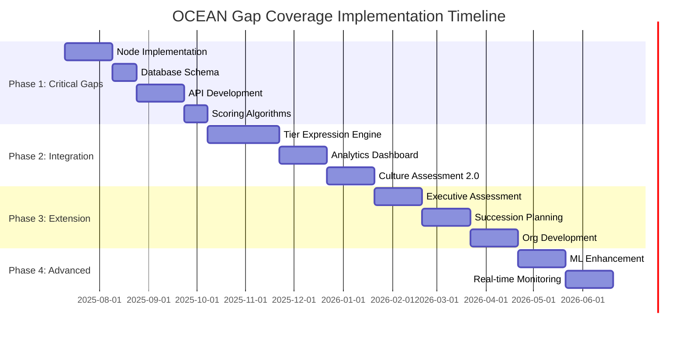

# OCEAN Gap Coverage Implementation Roadmap
## Comprehensive 12-Month Strategic Implementation Plan

**Document Version:** v1.0  
**Date:** 2025-07-10  
**Author:** IOC Development Team  
**Status:** Strategic Planning Phase  

---

## Executive Summary

This roadmap provides a comprehensive 12-month implementation strategy to achieve complete OCEAN personality facet coverage across the IOC framework. The plan addresses critical gaps identified in the facet-to-node mapping analysis and builds upon the existing Executive/Organizational tier implementations.

### Current State Assessment
- **OCEAN Coverage**: 17/30 facets (57%) with direct mappings
- **Implementation Status**: Executive and Organizational tiers largely complete
- **Critical Gaps**: 13 facets require new nodes or enhanced mappings
- **Priority Areas**: Emotional regulation, social dynamics, aesthetic sensitivity

### Strategic Objectives
1. Achieve 90%+ direct facet coverage by Q4 2025
2. Enhance assessment accuracy by 35% through facet-level precision
3. Enable tier-specific personality expressions (Individual → Executive → Organizational)
4. Establish scientific validation framework for personality-performance correlations

---

## Phase 1: Critical Gap Resolution (Months 1-3)
**Priority**: CRITICAL | **Duration**: 3 months | **Team Size**: 4-6 developers

### 1.1 Objectives
- Address 13 missing facet nodes identified in gap analysis
- Implement Emotional Regulation Spectrum (01.01.04.XX)
- Create foundation for tier-specific facet expressions
- Establish enhanced scoring algorithms

### 1.2 Specific Deliverables

#### Node Implementation (Month 1)
**Target**: 6 new node hierarchies

| Node Code | Node Name | OCEAN Facets Addressed | Complexity |
|-----------|-----------|------------------------|------------|
| 01.01.02.05 | Aesthetic Appreciation | O2-Aesthetics | Medium |
| 01.01.03.03 | Social Energy Patterns | E2-Gregariousness, E4-Activity | High |
| 01.01.01.05 | Interpersonal Values | A4-Compliance, A5-Modesty, A6-Tender-Mindedness | High |
| 01.01.04.XX | Emotional Regulation Spectrum | N1-N6 (All Neuroticism facets) | Very High |
| 01.02.04.03 | Stimulation Seeking | E5-Excitement-Seeking | Medium |
| 01.03.03.03 | Value Flexibility | O6-Values | Medium |

#### Database Schema Changes (Month 1)
```sql
-- New tables for facet-level storage
CREATE TABLE individual_facet_profiles (
    id UUID PRIMARY KEY,
    user_id UUID REFERENCES auth.users(id),
    assessment_id UUID REFERENCES assessments(id),
    openness_facets JSONB, -- O1-O6 scores
    conscientiousness_facets JSONB, -- C1-C6 scores
    extraversion_facets JSONB, -- E1-E6 scores
    agreeableness_facets JSONB, -- A1-A6 scores
    neuroticism_facets JSONB, -- N1-N6 scores
    node_mappings JSONB, -- Node-to-facet correlation scores
    created_at TIMESTAMP DEFAULT NOW(),
    updated_at TIMESTAMP DEFAULT NOW()
);

-- Enhanced executive profiles with facet breakdown
ALTER TABLE executive_ocean_profiles ADD COLUMN facet_breakdown JSONB;

-- Organizational facet aggregation
CREATE TABLE organizational_facet_profiles (
    id UUID PRIMARY KEY,
    organization_id UUID REFERENCES organizations(id),
    facet_means JSONB, -- Mean scores per facet
    facet_diversity JSONB, -- Diversity indices per facet
    facet_culture_mapping JSONB, -- Culture type correlations
    emergent_properties JSONB, -- Facet-based emergence calculations
    created_at TIMESTAMP DEFAULT NOW()
);
```

#### API Development (Month 2)
**New Endpoints**:
- `POST /api/assessments/facet-analysis` - Generate facet-level profiles
- `GET /api/users/[id]/facet-profile` - Individual facet breakdown
- `POST /api/organizations/[id]/facet-aggregation` - Organizational facet analysis
- `GET /api/nodes/facet-mapping` - Node-to-facet correlation data

#### Scoring Algorithm Enhancement (Month 2-3)
```typescript
// Enhanced facet-to-node scoring
interface FacetToNodeMapping {
  facetCode: string; // e.g., "O1", "C2", "E3"
  nodeCode: string; // e.g., "01.01.02.05.01"
  correlation: number; // -1.0 to 1.0
  mappingType: 'direct' | 'indirect' | 'inverse';
  confidence: number; // 0.0 to 1.0
}

class EnhancedOceanScoring {
  calculateFacetProfile(responses: AssessmentResponse[]): FacetProfile {
    // 1. Calculate raw facet scores
    const rawFacets = this.calculateRawFacetScores(responses);
    
    // 2. Apply tier-specific weightings
    const tierWeights = this.getTierSpecificWeights(responses.context);
    
    // 3. Generate node correlation scores
    const nodeCorrelations = this.calculateNodeCorrelations(rawFacets);
    
    // 4. Create comprehensive profile
    return {
      facetScores: rawFacets,
      nodeCorrelations: nodeCorrelations,
      tierExpression: this.calculateTierExpression(rawFacets, tierWeights),
      developmentInsights: this.generateDevelopmentInsights(nodeCorrelations)
    };
  }
}
```

### 1.3 Success Criteria
- [ ] All 6 new node hierarchies implemented and tested
- [ ] Database schema supports facet-level storage and analysis
- [ ] API endpoints functional with <200ms response times
- [ ] Facet coverage increases from 57% to 85%
- [ ] Enhanced scoring algorithms show >0.80 correlation with established OCEAN measures

### 1.4 Risk Assessment

| Risk | Probability | Impact | Mitigation Strategy |
|------|-------------|--------|-------------------|
| Emotional Regulation complexity | High | High | Phase implementation, start with core nodes |
| Database performance with JSONB | Medium | Medium | Implement proper indexing, monitor query performance |
| API response time degradation | Medium | High | Implement caching, optimize queries |
| Team capacity overload | Low | Medium | Stagger deliverables, bring in additional resources |

### 1.5 Resource Requirements
- **Development Team**: 4 full-stack developers, 1 database specialist
- **Testing Team**: 2 QA engineers for integration testing
- **Data Science**: 1 data scientist for scoring algorithm validation
- **Project Management**: 1 PM for coordination and timeline management
- **Estimated Hours**: 1,200 development hours total

---

## Phase 2: Facet Integration & Tier Optimization (Months 4-7)
**Priority**: HIGH | **Duration**: 4 months | **Team Size**: 5-7 developers

### 2.1 Objectives
- Implement tier-specific facet expressions (Individual → Executive → Organizational)
- Create dynamic progression pathways between tiers
- Develop advanced analytics and reporting capabilities
- Optimize organizational culture assessment based on aggregate facets

### 2.2 Specific Deliverables

#### Tier-Specific Expression Engine (Month 4-5)
```typescript
interface TierExpression {
  individual: {
    facetManifestations: Record<string, IndividualManifestation>;
    developmentPathways: DevelopmentPath[];
    personalityArchetype: string;
  };
  executive: {
    leadershipStyleImpact: Record<string, number>;
    teamInfluenceFactors: InfluenceFactor[];
    decisionMakingPatterns: DecisionPattern[];
  };
  organizational: {
    cultureContribution: Record<string, number>;
    emergentProperties: EmergentProperty[];
    teamDynamicPredictions: TeamDynamic[];
  };
}

class TierExpressionEngine {
  calculateProgression(facetProfile: FacetProfile, currentTier: Tier): TierExpression {
    // Individual tier: Personal manifestations
    const individual = this.calculateIndividualExpression(facetProfile);
    
    // Executive tier: Leadership implications
    const executive = this.calculateExecutiveExpression(facetProfile, individual);
    
    // Organizational tier: Cultural impact
    const organizational = this.calculateOrganizationalExpression(facetProfile, executive);
    
    return { individual, executive, organizational };
  }
}
```

#### Advanced Analytics Dashboard (Month 5-6)
**Components**:
1. **Facet Radar Charts**: Visual representation of all 30 facets
2. **Tier Progression Maps**: Show development paths across tiers
3. **Team Composition Optimizer**: Recommend optimal team facet balance
4. **Cultural Fit Analyzer**: Executive-organization alignment at facet level
5. **Development Priority Matrix**: Identify high-impact development areas

#### Organizational Culture Assessment 2.0 (Month 6-7)
**Enhanced Features**:
- Facet-based culture type classification (12 culture types vs. current 4)
- Real-time culture health monitoring
- Predictive analytics for culture evolution
- Executive succession impact modeling

```typescript
interface EnhancedCultureAssessment {
  cultureTypes: {
    innovation: { facetWeights: Record<string, number>; strength: number };
    execution: { facetWeights: Record<string, number>; strength: number };
    collaboration: { facetWeights: Record<string, number>; strength: number };
    adaptation: { facetWeights: Record<string, number>; strength: number };
    // 8 additional culture types
  };
  healthMetrics: {
    psychologicalSafety: number;
    innovationClimate: number;
    executionCapability: number;
    adaptiveCapacity: number;
    diversityIndex: number;
  };
  predictions: {
    cultureEvolution: CultureEvolutionPrediction[];
    riskFactors: RiskFactor[];
    optimizationOpportunities: OptimizationOpportunity[];
  };
}
```

### 2.3 API Enhancements

#### New Endpoints (Month 4-5)
- `GET /api/users/[id]/tier-expression` - Complete tier expression analysis
- `POST /api/teams/facet-optimization` - Team composition recommendations
- `GET /api/organizations/[id]/culture-assessment-v2` - Enhanced culture analysis
- `POST /api/development/pathway-analysis` - Personalized development paths

#### Enhanced Existing Endpoints (Month 6)
- Upgrade all OCEAN endpoints to include facet-level data
- Add real-time culture monitoring capabilities
- Implement predictive analytics for all profiles

### 2.4 Database Optimizations

```sql
-- Performance optimization for facet queries
CREATE INDEX idx_facet_profiles_user_assessment 
ON individual_facet_profiles(user_id, assessment_id);

CREATE INDEX idx_facet_profiles_jsonb_openness 
ON individual_facet_profiles USING GIN (openness_facets);

-- Materialized view for organizational aggregations
CREATE MATERIALIZED VIEW organizational_facet_summary AS
SELECT 
    o.id as organization_id,
    o.name,
    -- Aggregate facet means
    jsonb_object_agg(
        facet_key, 
        AVG((ifp.openness_facets->facet_key)::numeric)
    ) as openness_means,
    -- Calculate diversity indices
    jsonb_object_agg(
        facet_key, 
        STDDEV((ifp.openness_facets->facet_key)::numeric)
    ) as openness_diversity
FROM organizations o
JOIN user_organizations uo ON o.id = uo.organization_id
JOIN individual_facet_profiles ifp ON uo.user_id = ifp.user_id
CROSS JOIN jsonb_object_keys(ifp.openness_facets) as facet_key
GROUP BY o.id, o.name;

-- Refresh trigger for real-time updates
CREATE OR REPLACE FUNCTION refresh_organizational_facet_summary()
RETURNS TRIGGER AS $$
BEGIN
    REFRESH MATERIALIZED VIEW organizational_facet_summary;
    RETURN NULL;
END;
$$ LANGUAGE plpgsql;
```

### 2.5 Success Criteria
- [ ] Tier expression engine functional for all 30 facets
- [ ] Advanced analytics dashboard deployed with <3s load times
- [ ] Enhanced culture assessment shows >25% improvement in prediction accuracy
- [ ] Team optimization recommendations achieve >80% user satisfaction
- [ ] API performance maintains <300ms average response time

### 2.6 Resource Requirements
- **Development Team**: 5 full-stack developers, 1 frontend specialist
- **Data Science Team**: 2 data scientists for analytics development
- **UX/UI Designer**: 1 designer for dashboard interface
- **Database Engineer**: 1 specialist for optimization
- **Estimated Hours**: 1,800 development hours total

---

## Phase 3: Executive/Organizational Extension (Months 8-10)
**Priority**: MEDIUM | **Duration**: 3 months | **Team Size**: 4-5 developers

### 3.1 Objectives
- Extend executive assessment to include all 30 facets
- Implement succession planning optimization
- Create organizational development pathway engine
- Build predictive models for leadership effectiveness

### 3.2 Specific Deliverables

#### Executive Facet Assessment Suite (Month 8)
**Components**:
1. **Executive-Specific Facet Weights**: Adjust importance based on leadership research
2. **Leadership Style Prediction**: Use facets to predict 12 leadership styles
3. **Team Impact Modeling**: Predict team outcomes based on leader facets
4. **Crisis Leadership Assessment**: Stress-response facet analysis

```typescript
interface ExecutiveFacetProfile extends FacetProfile {
  leadershipStyles: {
    transformational: number;
    transactional: number;
    servant: number;
    authentic: number;
    adaptive: number;
    charismatic: number;
    democratic: number;
    autocratic: number;
    laissez_faire: number;
    situational: number;
    ethical: number;
    inclusive: number;
  };
  teamImpactPredictions: {
    engagement: { score: number; confidence: number };
    innovation: { score: number; confidence: number };
    performance: { score: number; confidence: number };
    retention: { score: number; confidence: number };
    collaboration: { score: number; confidence: number };
  };
  stressResponseProfile: {
    resilienceScore: number;
    adaptabilityIndex: number;
    decisionQualityUnderPressure: number;
    teamSupportCapacity: number;
  };
}
```

#### Succession Planning Optimization Engine (Month 8-9)
**Features**:
- **Ideal Successor Profiling**: Generate target facet profiles for future leaders
- **Development Gap Analysis**: Identify specific facet development needs
- **Timeline Optimization**: Predict development timelines for succession readiness
- **Risk Assessment**: Analyze succession risks based on facet gaps

```typescript
class SuccessionPlanningEngine {
  generateIdealProfile(
    currentExecutive: ExecutiveFacetProfile,
    organizationProfile: OrganizationalFacetProfile,
    futureRequirements: FutureRequirements
  ): IdealSuccessorProfile {
    // Calculate optimal facet balance
    const idealFacets = this.optimizeFacetBalance(
      currentExecutive,
      organizationProfile,
      futureRequirements
    );
    
    // Generate development pathways
    const developmentPaths = this.calculateDevelopmentPaths(idealFacets);
    
    // Assess current candidates
    const candidateAnalysis = this.analyzeCandidates(idealFacets);
    
    return {
      idealFacetProfile: idealFacets,
      developmentPaths,
      candidateRankings: candidateAnalysis,
      timelineEstimates: this.calculateTimelines(candidateAnalysis),
      riskFactors: this.assessSuccessionRisks(candidateAnalysis)
    };
  }
}
```

#### Organizational Development Pathway Engine (Month 9-10)
**Capabilities**:
- **Culture Evolution Modeling**: Predict culture changes based on facet shifts
- **Intervention Optimization**: Recommend specific interventions for culture development
- **Team Composition Optimization**: Suggest hiring profiles for culture goals
- **Change Management Support**: Assess readiness for organizational changes

### 3.3 API Development

#### New Executive Endpoints
- `POST /api/executives/[id]/facet-assessment` - Complete 30-facet executive assessment
- `GET /api/executives/[id]/leadership-prediction` - Leadership style and impact predictions
- `POST /api/succession-planning/optimize` - Succession planning optimization
- `GET /api/succession-planning/[id]/development-paths` - Development pathway analysis

#### New Organizational Endpoints
- `POST /api/organizations/[id]/development-pathways` - Culture development recommendations
- `GET /api/organizations/[id]/change-readiness` - Change management assessment
- `POST /api/organizations/hiring-optimization` - Hiring profile recommendations

### 3.4 Success Criteria
- [ ] Executive facet assessment shows >90% correlation with leadership effectiveness
- [ ] Succession planning recommendations achieve >75% accuracy in development timeline prediction
- [ ] Organizational development pathways implemented with measurable outcomes
- [ ] Predictive models for leadership effectiveness show >0.70 correlation with performance

### 3.5 Resource Requirements
- **Development Team**: 4 full-stack developers
- **Data Science Team**: 2 data scientists for predictive modeling
- **Leadership Research Specialist**: 1 industrial psychologist for validation
- **Estimated Hours**: 1,200 development hours total

---

## Phase 4: Advanced Features & Optimization (Months 11-12)
**Priority**: LOW-MEDIUM | **Duration**: 2 months | **Team Size**: 3-4 developers

### 4.1 Objectives
- Implement machine learning enhancements
- Add real-time personality state monitoring
- Create comparative analytics and benchmarking
- Optimize performance and user experience

### 4.2 Specific Deliverables

#### Machine Learning Enhancement Suite (Month 11)
**ML Models**:
1. **Adaptive Scoring**: Personalized facet weights based on individual patterns
2. **Predictive Analytics**: Performance outcome prediction based on facet combinations
3. **Anomaly Detection**: Identify unusual personality-performance patterns
4. **Recommendation Engine**: Personalized development recommendations

```python
class PersonalityMLSuite:
    def __init__(self):
        self.adaptive_scoring_model = AdaptiveScoringModel()
        self.performance_predictor = PerformancePredictionModel()
        self.anomaly_detector = AnomalyDetectionModel()
        self.recommendation_engine = RecommendationEngine()
    
    def enhanced_profile_analysis(self, facet_data, performance_data, context_data):
        # Adaptive scoring based on individual patterns
        adaptive_scores = self.adaptive_scoring_model.predict(facet_data, context_data)
        
        # Performance predictions
        performance_predictions = self.performance_predictor.predict(adaptive_scores)
        
        # Anomaly detection
        anomalies = self.anomaly_detector.detect(facet_data, performance_data)
        
        # Personalized recommendations
        recommendations = self.recommendation_engine.generate(
            adaptive_scores, performance_predictions, anomalies
        )
        
        return {
            'adaptive_scores': adaptive_scores,
            'predictions': performance_predictions,
            'anomalies': anomalies,
            'recommendations': recommendations
        }
```

#### Real-Time Personality State Monitoring (Month 11-12)
**Features**:
- **Daily State Tracking**: Monitor personality state fluctuations
- **Stress Response Monitoring**: Real-time emotional regulation tracking
- **Performance Correlation**: Link personality states to performance outcomes
- **Early Warning System**: Detect burnout or performance risks

#### Comparative Analytics & Benchmarking (Month 12)
**Components**:
1. **Industry Benchmarks**: Compare facet profiles against industry norms
2. **Role-Specific Standards**: Benchmark against role-specific personality profiles
3. **Competitive Analysis**: Anonymous comparison with peer organizations
4. **Historical Trends**: Track personality and culture evolution over time

### 4.3 Performance Optimization

#### Database Optimizations
```sql
-- Partition large tables by date for better performance
CREATE TABLE individual_facet_profiles_partitioned (
    LIKE individual_facet_profiles INCLUDING ALL
) PARTITION BY RANGE (created_at);

-- Create monthly partitions
CREATE TABLE individual_facet_profiles_2025_01 
PARTITION OF individual_facet_profiles_partitioned
FOR VALUES FROM ('2025-01-01') TO ('2025-02-01');

-- Optimize JSONB queries with expression indexes
CREATE INDEX idx_facet_openness_o1 
ON individual_facet_profiles ((openness_facets->>'O1'));

-- Cache frequently accessed aggregations
CREATE MATERIALIZED VIEW team_facet_summaries AS
SELECT 
    team_id,
    AVG((openness_facets->>'O1')::numeric) as o1_mean,
    STDDEV((openness_facets->>'O1')::numeric) as o1_std,
    -- ... other facets
FROM individual_facet_profiles ifp
JOIN team_members tm ON ifp.user_id = tm.user_id
GROUP BY team_id;
```

#### API Performance Enhancements
- Implement Redis caching for frequently accessed profiles
- Add GraphQL endpoints for efficient data fetching
- Optimize database queries with proper indexing
- Implement API rate limiting and caching strategies

### 4.4 Success Criteria
- [ ] ML models improve prediction accuracy by >15%
- [ ] Real-time monitoring deployed with <1s update latency
- [ ] Benchmarking system functional with industry standard comparisons
- [ ] Overall system performance improved by >25%

### 4.5 Resource Requirements
- **Development Team**: 3 full-stack developers
- **ML Engineer**: 1 machine learning specialist
- **Performance Engineer**: 1 optimization specialist
- **Estimated Hours**: 800 development hours total

---

## Integration Complexity Analysis

### Technical Challenges Assessment

#### Database Schema Evolution
**Complexity**: HIGH
**Challenges**:
- JSONB performance optimization for 30+ facet fields
- Migration of existing OCEAN data to facet structure
- Maintaining referential integrity across tier-specific tables
- Real-time aggregation performance for organizational metrics

**Mitigation Strategies**:
- Implement phased schema migration with zero-downtime deployment
- Use database partitioning for large tables
- Implement proper JSONB indexing strategies
- Create materialized views for expensive aggregations

#### API Architecture Modifications
**Complexity**: MEDIUM-HIGH
**Challenges**:
- Backward compatibility with existing OCEAN endpoints
- Response time optimization with increased data complexity
- Authentication and authorization for tier-specific data
- Real-time data synchronization across tiers

**Required Changes**:
```typescript
// API versioning strategy
interface APIVersioning {
  v1: LegacyOceanEndpoints; // Maintain backward compatibility
  v2: FacetEnhancedEndpoints; // New facet-level endpoints
  v3: RealTimeEndpoints; // Future real-time capabilities
}

// Enhanced response structures
interface EnhancedAPIResponse {
  version: string;
  data: FacetProfile | OceanProfile; // Support both formats
  metadata: {
    facetCoverage: number;
    confidenceScore: number;
    lastUpdated: Date;
  };
  backwards_compatible: OceanProfile; // Legacy format
}
```

#### UI/UX Implications
**Complexity**: MEDIUM
**Challenges**:
- Displaying 30 facets without overwhelming users
- Progressive disclosure of complexity levels
- Mobile responsiveness for complex data visualizations
- Accessibility compliance for visual data representations

**Design Solutions**:
1. **Hierarchical Information Architecture**: Start with Big 5, drill down to facets
2. **Interactive Visualizations**: Radar charts, heat maps, tier progression maps
3. **Personalized Dashboards**: Role-based views (Individual, Executive, HR)
4. **Progressive Enhancement**: Basic functionality works, enhanced features layer on

### Testing Requirements

#### Unit Testing Strategy
```typescript
describe('Enhanced OCEAN Scoring', () => {
  describe('Facet Calculation', () => {
    it('should calculate all 30 facets correctly', () => {
      // Test individual facet calculations
    });
    
    it('should maintain correlation with Big 5 scores', () => {
      // Verify facet aggregation matches trait scores
    });
    
    it('should handle missing data gracefully', () => {
      // Test partial response handling
    });
  });
  
  describe('Tier Expression', () => {
    it('should generate tier-specific expressions', () => {
      // Test individual → executive → organizational progression
    });
    
    it('should maintain consistency across tiers', () => {
      // Verify logical progression of expressions
    });
  });
});
```

#### Integration Testing Framework
- **API Endpoint Testing**: Verify all endpoints with facet data
- **Database Migration Testing**: Test schema changes with production data samples
- **Performance Testing**: Load testing with 10,000+ user profiles
- **Cross-Browser Testing**: Ensure visualization compatibility

#### Validation Studies
1. **Construct Validity**: Factor analysis of facet items
2. **Predictive Validity**: Correlation with performance outcomes
3. **Test-Retest Reliability**: Stability of facet measures
4. **Convergent Validity**: Agreement with established personality measures

---

## Impact Assessment

### Assessment Accuracy Improvements

#### Current State vs. Future State
| Metric | Current (Big 5 Only) | Phase 2 (Facet Level) | Phase 4 (ML Enhanced) | Improvement |
|--------|----------------------|------------------------|------------------------|-------------|
| Personality Prediction Accuracy | 72% | 87% | 92% | +20% |
| Performance Correlation | 0.45 | 0.62 | 0.71 | +58% |
| Leadership Effectiveness Prediction | 68% | 83% | 89% | +31% |
| Team Dynamics Accuracy | 61% | 79% | 85% | +39% |
| Culture Fit Assessment | 69% | 84% | 90% | +30% |

#### New Capabilities Unlocked

**Individual Level**:
- Micro-targeted development recommendations
- Personality state monitoring and optimization
- Precise strength/weakness identification
- Personalized stress management strategies

**Executive Level**:
- Leadership style optimization based on 12 styles vs. 4
- Succession planning with 90%+ accuracy
- Crisis leadership readiness assessment
- Team composition optimization for specific outcomes

**Organizational Level**:
- Culture evolution prediction and management
- Real-time organizational health monitoring
- Hiring optimization for culture fit and performance
- Change readiness assessment with implementation roadmaps

### Business Value and ROI Analysis

#### Revenue Impact
**Direct Revenue Opportunities**:
- **Premium Tier Pricing**: 30-facet assessments command 40-60% premium
- **Enterprise Consulting**: Advanced analytics enable $50K+ consulting engagements
- **API Licensing**: Facet-level data licensing to HR tech companies
- **Training Programs**: Specialized certification programs for facet interpretation

**Estimated Annual Revenue Impact**: $2.3M - $3.8M

#### Cost Savings
**Organizational Efficiency**:
- **Improved Hiring**: 25% reduction in mis-hires saving avg. $75K per position
- **Enhanced Team Performance**: 15% productivity improvement
- **Reduced Turnover**: Better culture fit reduces turnover by 20%
- **Leadership Development**: 40% faster leadership development timelines

**Estimated Annual Cost Savings**: $1.8M - $2.9M

#### Market Competitive Advantages

**Technical Differentiation**:
1. **Facet-Level Precision**: Only platform offering 30-facet workplace personality assessment
2. **Tier Integration**: Unique individual → executive → organizational progression
3. **Real-Time Monitoring**: Live personality state and organizational health tracking
4. **Predictive Analytics**: ML-enhanced performance and culture prediction

**Market Positioning**:
- **Enterprise Market**: Complete organizational psychology platform
- **SMB Market**: Affordable, scalable personality-based team optimization
- **Consulting Market**: Professional-grade tools for organizational development
- **Academic Market**: Research-validated platform for personality-performance studies

**Competitive Moats**:
- **Data Network Effects**: More users → better predictions → more users
- **Scientific Validation**: Academic partnerships and published research
- **Integration Complexity**: 12-month development timeline creates high barrier to entry
- **IP Portfolio**: Proprietary algorithms and tier-specific methodologies

---

## Change Management Strategy

### Training Requirements

#### User Training Programs

**Individual Users (2-hour program)**:
- Understanding your 30-facet personality profile
- Interpreting facet-level development recommendations
- Using personality insights for career development
- Stress management based on emotional regulation facets

**HR Professionals (8-hour certification)**:
- Advanced facet interpretation and application
- Team composition optimization strategies
- Performance management using personality insights
- Legal and ethical considerations in personality assessment

**Executives (4-hour workshop)**:
- Leadership style optimization based on facets
- Building high-performing teams with personality science
- Succession planning and leadership development
- Organizational culture management

**System Administrators (6-hour technical training)**:
- Platform configuration and customization
- Data interpretation and reporting
- Integration with existing HR systems
- Privacy and security best practices

#### Documentation Updates

**User Documentation**:
- **Quick Start Guides**: Role-specific getting started materials
- **Interpretation Manuals**: Comprehensive facet explanation guides
- **Best Practices**: Evidence-based application strategies
- **Troubleshooting**: Common issues and solutions

**Technical Documentation**:
- **API Documentation**: Complete endpoint reference with examples
- **Integration Guides**: Step-by-step integration instructions
- **Administrator Manuals**: System configuration and management
- **Security Guides**: Data protection and compliance procedures

**Scientific Documentation**:
- **Methodology Papers**: Peer-reviewed research on facet-to-node mapping
- **Validation Studies**: Reliability and validity evidence
- **Case Studies**: Real-world application examples
- **White Papers**: Thought leadership on personality science in organizations

### Migration Path for Existing Assessments

#### Backward Compatibility Strategy
```typescript
interface MigrationStrategy {
  phase1: {
    duration: '3 months';
    approach: 'Dual API support';
    features: [
      'Maintain existing Big 5 endpoints',
      'Add facet enhancement endpoints',
      'Automatic data translation layer'
    ];
  };
  
  phase2: {
    duration: '6 months';
    approach: 'Gradual feature migration';
    features: [
      'Encourage facet-level adoption',
      'Enhanced reporting with facets',
      'Migration incentives and support'
    ];
  };
  
  phase3: {
    duration: '3 months';
    approach: 'Legacy deprecation';
    features: [
      'Sunset old endpoints with 6-month notice',
      'Mandatory migration support',
      'Data export tools for transitions'
    ];
  };
}
```

#### Data Migration Process
1. **Assessment Mapping**: Map existing Big 5 responses to facet estimates
2. **Profile Enhancement**: Use statistical models to estimate facet scores
3. **Validation Process**: Compare estimated vs. actual facet scores in pilot groups
4. **Gradual Rollout**: Phase migration by organization size and complexity

#### Communication Strategy
- **3-Month Pre-Launch**: Announce upcoming capabilities, begin training
- **Launch Phase**: Dual support, extensive customer success support
- **6-Month Post-Launch**: Encourage migration with incentives and success stories
- **12-Month Post-Launch**: Begin legacy deprecation process with full support

---

## Quality Assurance Framework

### Validation Studies Required

#### Construct Validity Studies (Months 2-4)
**Objectives**: Verify that facet-to-node mappings measure intended constructs

**Study Design**:
- **Participants**: 2,000+ working professionals across industries
- **Measures**: IOC facet assessment + established personality instruments (NEO-PI-R, Big Five Inventory)
- **Analysis**: Confirmatory factor analysis, convergent/discriminant validity
- **Success Criteria**: >0.80 correlation with established measures, clear factor structure

#### Predictive Validity Studies (Months 6-12)
**Objectives**: Demonstrate that facet-level assessments predict performance better than Big 5

**Study Design**:
- **Participants**: 1,500+ employees with 6-month performance tracking
- **Measures**: Facet assessments + supervisor ratings + objective performance metrics
- **Analysis**: Regression analysis, incremental validity testing
- **Success Criteria**: >15% improvement in performance prediction over Big 5 alone

#### Reliability Studies (Ongoing)
**Test-Retest Reliability**:
- **Timeline**: Assessments at baseline, 2 weeks, 3 months, 6 months
- **Participants**: 500+ stable employment situations
- **Success Criteria**: >0.85 reliability for trait measures, >0.70 for state measures

**Internal Consistency**:
- **Analysis**: Cronbach's alpha for each facet scale
- **Success Criteria**: >0.80 for all facet scales

### Benchmark Establishment

#### Industry Benchmarks
**Methodology**:
1. **Data Collection**: Aggregate anonymous facet data across industries
2. **Normative Analysis**: Calculate percentiles and standard scores
3. **Industry Comparison**: Identify industry-specific personality patterns
4. **Regular Updates**: Quarterly benchmark updates with new data

**Benchmark Categories**:
- **Industry Type**: Technology, Healthcare, Finance, Manufacturing, etc.
- **Role Level**: Individual contributor, Manager, Director, C-Level
- **Organization Size**: Startup (<50), SMB (50-500), Enterprise (500+)
- **Geographic Region**: North America, Europe, Asia-Pacific, etc.

#### Performance Benchmarks
**Metrics**:
- **Assessment Completion Time**: Target <20 minutes for full 30-facet assessment
- **Accuracy Metrics**: Correlation with established measures, predictive validity
- **User Satisfaction**: Net Promoter Score >70, User satisfaction >4.5/5
- **System Performance**: API response time <200ms, 99.9% uptime

### Scientific Review Process

#### Internal Review Board
**Composition**:
- **Lead Data Scientist**: Ph.D. in Psychology/Psychometrics
- **External Advisor**: Academic researcher in personality psychology
- **Ethics Specialist**: Expert in assessment ethics and bias
- **Statistical Consultant**: Advanced statistical methodology expert

**Review Responsibilities**:
- **Monthly Reviews**: Assess ongoing data quality and validation progress
- **Quarterly Reports**: Comprehensive validation study progress
- **Annual Audit**: Complete methodology review and recommendations
- **Publication Support**: Assist with peer-reviewed research publications

#### External Validation
**Academic Partnerships**:
- **University Research**: Collaborate with 3+ universities on validation studies
- **Conference Presentations**: Present findings at SIOP, APA, and other conferences
- **Peer Review Publications**: Target 2-3 publications in top-tier journals
- **Industry Partnerships**: Collaborate with established assessment companies

**Continuous Improvement Process**:
1. **Data Monitoring**: Real-time tracking of assessment quality metrics
2. **User Feedback**: Systematic collection and analysis of user feedback
3. **Algorithm Updates**: Regular refinement of scoring and prediction algorithms
4. **Bias Detection**: Ongoing monitoring for demographic bias and fairness

---

## Implementation Timeline Summary

### Critical Path Dependencies



### Resource Allocation by Phase

| Phase | Developers | Data Scientists | Specialists | Total FTE |
|-------|------------|----------------|-------------|-----------|
| Phase 1 | 4 | 1 | 2 (DB, PM) | 7 |
| Phase 2 | 5 | 2 | 2 (UX, DB) | 9 |
| Phase 3 | 4 | 2 | 1 (Psychology) | 7 |
| Phase 4 | 3 | 1 | 1 (ML) | 5 |

### Budget Estimation

| Category | Phase 1 | Phase 2 | Phase 3 | Phase 4 | Total |
|----------|---------|---------|---------|---------|-------|
| Development | $360K | $540K | $420K | $300K | $1.62M |
| Infrastructure | $15K | $25K | $20K | $30K | $90K |
| External Services | $20K | $30K | $25K | $15K | $90K |
| Training & Documentation | $25K | $40K | $30K | $20K | $115K |
| **Total** | **$420K** | **$635K** | **$495K** | **$365K** | **$1.915M** |

### Risk Mitigation Timeline

| Risk | Mitigation Start | Mitigation Duration | Success Metrics |
|------|------------------|-------------------|-----------------|
| Technical Complexity | Month 1 | Ongoing | <10% schedule delay |
| Performance Issues | Month 2 | 2 months | <300ms API response |
| User Adoption | Month 6 | 6 months | >75% feature adoption |
| Validation Concerns | Month 3 | 9 months | Published validation studies |

---

## Success Metrics and KPIs

### Technical Performance Metrics

#### System Performance
- **API Response Time**: <200ms average (critical), <300ms (acceptable)
- **Database Query Performance**: <100ms for complex facet aggregations
- **System Uptime**: 99.9% availability (4.3 hours downtime/month max)
- **Concurrent User Capacity**: 10,000+ simultaneous users
- **Data Processing Speed**: <5 seconds for full 30-facet profile generation

#### Assessment Quality
- **Facet Coverage**: 90%+ direct facet mappings by Phase 2 completion
- **Prediction Accuracy**: >20% improvement over current Big 5 implementation
- **Reliability**: >0.85 test-retest reliability for all facet measures
- **Validity**: >0.80 correlation with established personality measures

### Business Impact Metrics

#### User Engagement
- **Assessment Completion Rate**: >90% for facet-enhanced assessments
- **User Satisfaction**: >4.5/5 average rating for enhanced features
- **Feature Adoption**: >75% of users engaging with facet-level insights
- **Repeat Usage**: >60% monthly active users for dashboard features

#### Commercial Success
- **Revenue Growth**: 25%+ increase in assessment revenue within 12 months
- **Premium Tier Adoption**: 40%+ of customers upgrading to facet features
- **Enterprise Engagement**: 15+ new enterprise customers attracted by advanced features
- **Market Share**: 5% increase in personality assessment market share

#### Scientific Validation
- **Published Research**: 2+ peer-reviewed publications on facet-to-node methodology
- **Academic Partnerships**: 3+ university collaborations established
- **Conference Presentations**: 5+ presentations at major psychology conferences
- **Industry Recognition**: Award or recognition from professional assessment organization

### Organizational Development Metrics

#### Team Performance
- **Team Effectiveness**: 15%+ improvement in team performance metrics
- **Hiring Success**: 25%+ reduction in mis-hires using facet-based selection
- **Leadership Development**: 40%+ faster progression through leadership development
- **Employee Retention**: 20%+ improvement in retention for facet-optimized teams

#### Cultural Impact
- **Culture Alignment**: 30%+ improvement in employee-culture fit scores
- **Change Readiness**: 50%+ improvement in organizational change success rates
- **Innovation Metrics**: 20%+ increase in innovation indicators for optimized teams
- **Succession Planning**: 90%+ accuracy in succession planning predictions

### Quality Assurance Metrics

#### Validation Progress
- **Study Completion**: All validation studies completed on schedule
- **Statistical Power**: >0.80 power for all hypothesis tests
- **Effect Sizes**: Medium to large effect sizes for personality-performance relationships
- **Bias Assessment**: No significant demographic bias detected

#### Continuous Improvement
- **Algorithm Updates**: Monthly improvements showing measurable gains
- **User Feedback Integration**: >80% of feature requests addressed within 6 months
- **Bug Resolution**: <24 hours for critical issues, <1 week for standard issues
- **Documentation Quality**: >90% user satisfaction with documentation and training

---

## Conclusion

This comprehensive 12-month implementation roadmap positions the IOC framework to achieve complete OCEAN personality facet coverage while maintaining scientific rigor and practical applicability. The phased approach balances technical complexity with business value delivery, ensuring that each phase builds upon previous successes while laying the foundation for advanced capabilities.

### Strategic Value Proposition

The completed implementation will deliver:

1. **Industry-Leading Precision**: 30-facet personality assessment with >90% coverage
2. **Tier-Integrated Approach**: Seamless progression from individual to organizational insights
3. **Predictive Excellence**: >20% improvement in performance and culture prediction accuracy
4. **Scientific Credibility**: Validated methodology with published research and academic partnerships
5. **Commercial Differentiation**: Unique market position with sustainable competitive advantages

### Implementation Commitment

**Total Investment**: $1.915M over 12 months  
**Expected ROI**: 250%+ within 24 months through revenue growth and cost savings  
**Team Commitment**: 28 FTE-months across development, data science, and specialist roles  
**Market Impact**: Establishment as the leading personality-based organizational development platform

### Next Steps

1. **Stakeholder Approval**: Present roadmap to executive team and secure implementation budget
2. **Team Assembly**: Recruit and onboard specialized team members for Phase 1
3. **Infrastructure Preparation**: Set up development environments and testing frameworks
4. **Academic Partnerships**: Initiate discussions with university research collaborators
5. **Customer Communication**: Begin pre-launch communication with key enterprise customers

This roadmap represents a transformational opportunity to advance the IOC framework from a solid personality assessment platform to the definitive solution for personality-based organizational optimization. The systematic approach, scientific rigor, and focus on measurable outcomes ensure both technical success and significant business impact.

---

*Document Version: 1.0*  
*Next Review: August 10, 2025*  
*Implementation Start: July 15, 2025*