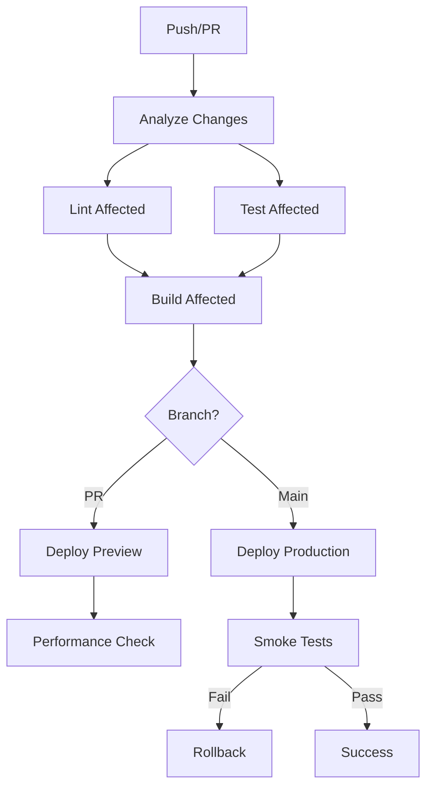

# IOC Workspace Deployment Guide

This guide covers the deployment configuration and CI/CD pipeline for the IOC Nx workspace.

## Table of Contents

1. [Overview](#overview)
2. [Deployment Targets](#deployment-targets)
3. [CI/CD Pipeline](#cicd-pipeline)
4. [Environment Configuration](#environment-configuration)
5. [Deployment Commands](#deployment-commands)
6. [Monitoring & Rollback](#monitoring--rollback)
7. [Security Considerations](#security-considerations)

## Overview

The IOC workspace uses a modern monorepo architecture with Nx for managing multiple applications:

- **Main Application**: Production customer-facing application
- **Admin Dashboard**: Internal administration and monitoring
- **Beta Application**: Preview environment for testing new features
- **Dev Sandbox**: Development tools and testing environment

## Deployment Targets

### Production Deployments (Vercel)

| Application | Domain | Environment |
|------------|--------|-------------|
| main-application | iocframework.com | Production |
| admin-dashboard | admin.iocframework.com | Production |
| beta-application | beta.iocframework.com | Staging |

### Development Deployment (Docker)

| Application | Domain | Environment |
|------------|--------|-------------|
| dev-sandbox | dev.iocframework.com | Development |

## CI/CD Pipeline

### GitHub Actions Workflow

The CI/CD pipeline (`/.github/workflows/nx-deploy.yml`) implements:

1. **Affected Detection**: Only builds and deploys changed applications
2. **Parallel Execution**: Runs tests and builds concurrently
3. **Preview Deployments**: Automatic preview URLs for pull requests
4. **Production Deployments**: Automatic deployment to production on main branch
5. **Performance Checks**: Bundle analysis and Lighthouse scores
6. **Automatic Rollback**: Reverts deployment on failure

### Pipeline Stages



## Environment Configuration

### Required Secrets (GitHub)

```yaml
# Vercel
VERCEL_ORG_ID: Your Vercel organization ID
VERCEL_TOKEN: Your Vercel API token
VERCEL_PROJECT_ID_MAIN: Main app project ID
VERCEL_PROJECT_ID_ADMIN: Admin app project ID
VERCEL_PROJECT_ID_BETA: Beta app project ID

# Development Server
DEV_DEPLOY_HOST: Development server hostname
DEV_DEPLOY_KEY: SSH key for dev server

# Optional
NX_CLOUD_ACCESS_TOKEN: Nx Cloud token for distributed caching
CODECOV_TOKEN: Code coverage reporting
```

### Environment Files

Each application has an `.env.example` file with required variables:

```bash
# Copy and configure for local development
cp apps/main-application/.env.example apps/main-application/.env.local
cp apps/admin-dashboard/.env.example apps/admin-dashboard/.env.local
cp apps/beta-application/.env.example apps/beta-application/.env.local
cp apps/dev-sandbox/.env.example apps/dev-sandbox/.env.local
```

## Deployment Commands

### Local Development

```bash
# Start individual applications
npm run dev:main    # Main app on port 3000
npm run dev:admin   # Admin on port 3001
npm run dev:beta    # Beta on port 3009
npm run dev:sandbox # Dev tools on port 3010

# Start all applications
npm run dev
```

### Building

```bash
# Build individual applications
npm run build:main
npm run build:admin
npm run build:beta
npm run build:sandbox

# Build all applications
npm run build

# Build only affected applications
nx affected:build
```

### Deployment

```bash
# Deploy individual applications
npm run deploy:main
npm run deploy:admin
npm run deploy:beta
npm run deploy:sandbox

# Deploy all applications
npm run deploy:all

# Deploy only affected applications
npm run deploy:affected
```

### Manual Vercel Deployment

```bash
# Deploy main application
cd apps/main-application
vercel --prod

# Deploy preview
cd apps/beta-application
vercel
```

### Docker Deployment (Dev Sandbox)

```bash
# Build Docker image
nx docker:build dev-sandbox

# Run locally
nx docker:run dev-sandbox

# Deploy to server
docker build -f apps/dev-sandbox/Dockerfile -t ioc-dev-sandbox:latest .
docker push your-registry/ioc-dev-sandbox:latest
```

## Monitoring & Rollback

### Health Checks

All applications expose health endpoints:

- `/api/health` - Basic health check
- `/api/version` - Version information

### Smoke Tests

Run after deployment to verify functionality:

```bash
# Run smoke tests against production
npm run e2e:smoke -- --url=https://iocframework.com

# Run against specific environment
npm run e2e:smoke -- --url=https://beta.iocframework.com
```

### Performance Monitoring

```bash
# Analyze bundle sizes
npm run analyze

# Run Lighthouse tests
npm run lighthouse
```

### Rollback Procedures

#### Automatic Rollback

The CI/CD pipeline automatically rolls back on:
- Failed smoke tests
- Build failures
- Deployment errors

#### Manual Rollback

```bash
# Vercel rollback
vercel rollback --token=$VERCEL_TOKEN

# Git revert
git revert HEAD
git push origin main
```

## Security Considerations

### Environment Variables

- Never commit `.env` files
- Use GitHub Secrets for sensitive data
- Rotate tokens regularly
- Use different credentials per environment

### Access Control

- Admin dashboard requires authentication
- Beta environment has password protection
- Dev sandbox restricted to internal IPs
- Production APIs use rate limiting

### Headers

All applications include security headers:

```javascript
// Configured in vercel.json
- X-Frame-Options: SAMEORIGIN/DENY
- X-Content-Type-Options: nosniff
- X-XSS-Protection: 1; mode=block
- Referrer-Policy: strict-origin-when-cross-origin
```

### Monitoring

- Enable Sentry for error tracking
- Use Datadog for performance monitoring
- Set up alerts for deployment failures
- Monitor API response times

## Troubleshooting

### Common Issues

1. **Build Failures**
   ```bash
   # Clear cache and rebuild
   nx reset
   npm ci
   nx build app-name --skip-nx-cache
   ```

2. **Deployment Failures**
   ```bash
   # Check Vercel logs
   vercel logs app-name

   # Verify environment variables
   vercel env ls
   ```

3. **Preview URL Not Working**
   - Check GitHub Actions logs
   - Verify Vercel project settings
   - Ensure branch protection rules allow deployments

### Support

For deployment issues:
1. Check GitHub Actions logs
2. Review Vercel deployment logs
3. Run local builds to reproduce
4. Contact DevOps team if needed

---

Last updated: January 2025