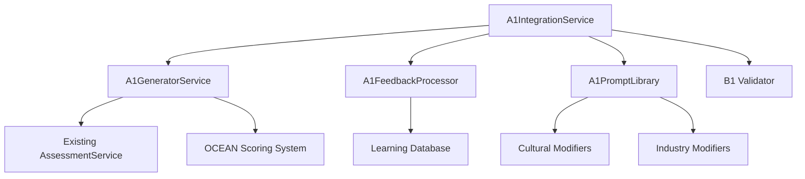

# A1 Generator System Implementation
## IOC's Practical Dual-AI Approach - Creator Component

### Overview

The A1 Generator System is the creative engine of IOC's dual-AI approach, designed to enhance existing assessment capabilities through intelligent content generation, personalized insights, and adaptive learning. This implementation provides a comprehensive solution that integrates seamlessly with the existing IOC framework while adding powerful AI-driven enhancements.

---

## 🚀 Quick Start

### Installation and Setup

```typescript
import { createA1System, A1Configuration } from '@ioc/lib/ai-dual-system/services';
import { AssessmentService } from '@ioc/lib/api/assessments/service';

// Configuration
const config: A1Configuration = {
  anthropicApiKey: process.env.ANTHROPIC_API_KEY,
  openaiApiKey: process.env.OPENAI_API_KEY,
  primaryModel: 'claude-3-opus',
  fallbackModel: 'gpt-4-turbo',
  temperature: 0.7,
  maxTokens: 4096,
  enableLearning: true,
  enablePersonalization: true,
  confidenceThreshold: 0.7
};

// Create A1 system
const assessmentService = new AssessmentService(supabase);
const a1System = createA1System({
  anthropicApiKey: config.anthropicApiKey,
  openaiApiKey: config.openaiApiKey,
  assessmentService,
  configuration: config
});
```

### Basic Usage

```typescript
// Enhanced Assessment Generation
const assessmentRequest = {
  type: 'personality',
  tier: 'individual' as const,
  context: {
    userId: 'user-123',
    organizationId: 'org-456',
    assessmentType: 'personality',
    tier: 'individual' as const,
    culturalContext: 'Western',
    industryContext: 'Technology',
    roleContext: 'Engineering Manager'
  },
  options: {
    enableAI: true,
    personalizationLevel: 'high' as const,
    culturalAdaptation: true,
    industryAdaptation: true
  }
};

const serviceContext = {
  userId: 'user-123',
  organizationId: 'org-456',
  sessionId: 'session-789'
};

const enhancedAssessment = await a1System.generateEnhancedAssessment(
  assessmentRequest,
  serviceContext
);

console.log('AI Enhancements:', enhancedAssessment.aiEnhancements);
```

---

## 🏗️ System Architecture

### Core Components

1. **A1GeneratorService**: Main content generation engine
2. **A1FeedbackProcessor**: Handles B1 feedback and learning
3. **A1PromptLibrary**: Dynamic prompt generation and evolution
4. **A1IntegrationService**: Orchestrates all components

### Component Relationships



---

## 🔧 Core Features

### 1. Enhanced Assessment Generation

The A1 system generates contextually-aware assessment questions that adapt to:

- **Cultural Context**: Questions adapted for different cultural backgrounds
- **Industry Context**: Scenarios relevant to specific industries
- **Role Context**: Appropriate complexity and relevance for role level
- **User History**: Personalized based on previous interactions

```typescript
// Example: Cultural Adaptation
const culturallyAdaptedQuestions = await a1System.generateEnhancedAssessment({
  type: 'leadership',
  tier: 'executive',
  context: {
    culturalContext: 'East Asian Collectivist',
    industryContext: 'Healthcare',
    roleContext: 'C-Suite Executive'
  },
  options: {
    culturalAdaptation: true,
    personalizationLevel: 'high'
  }
}, serviceContext);

// Result: Questions emphasize group harmony, consensus building,
// and use healthcare-specific scenarios
```

### 2. Intelligent Report Generation

Creates comprehensive, personalized reports with:

- **Executive Summaries**: Concise, impact-focused overviews
- **Detailed Analysis**: In-depth OCEAN and pillar-based insights
- **Actionable Recommendations**: Immediate, short-term, and long-term actions
- **Personal Narratives**: Engaging stories that resonate with individuals

```typescript
// Example: Personalized Report Generation
const reportRequest = {
  assessmentResults: {
    oceanScores: userOceanScores,
    pillarScores: userPillarScores
  },
  userContext: {
    role: 'Engineering Manager',
    experience: '5 years',
    industry: 'Technology'
  },
  reportType: 'individual' as const,
  options: {
    includePersonalization: true,
    narrativeStyle: 'conversational'
  }
};

const enhancedReport = await a1System.generateEnhancedReport(
  reportRequest,
  serviceContext
);

// Result: Highly personalized report with tech industry examples,
// management-focused recommendations, and engaging narrative
```

### 3. Continuous Learning from B1 Feedback

The system learns and improves from B1 validator feedback:

- **Pattern Recognition**: Identifies recurring issues
- **Node-Level Revisions**: Precise content corrections
- **Consistency Maintenance**: Ensures coherent documents
- **Knowledge Integration**: Applies learning to future generations

```typescript
// Example: Processing B1 Feedback
const originalContent = enhancedReport.report;
const b1Feedback = {
  issues: [
    {
      type: 'bias',
      severity: 'medium',
      description: 'Gender-biased language in leadership section',
      location: 'leadership_recommendations',
      suggestedFix: 'Use gender-neutral language'
    }
  ],
  suggestions: ['Consider diverse leadership styles'],
  scores: {
    ethical: 0.7,
    bias: 0.6,
    quality: 0.9,
    compliance: 0.95,
    overall: 0.8
  }
};

const revisedContent = await a1System.processB1Feedback(
  originalContent,
  b1Feedback,
  serviceContext
);

// Result: Content revised to address bias, learning applied for future
```

### 4. Dynamic Prompt Evolution

Prompts continuously improve based on:

- **Usage Metrics**: Completion rates, engagement scores
- **User Feedback**: Direct feedback and satisfaction ratings
- **Performance Data**: Accuracy and effectiveness measurements
- **A/B Testing**: Systematic comparison of prompt variations

```typescript
// Example: Prompt Evolution
const evolutionResults = await a1System.promptLibrary.evolvePrompts();

evolutionResults.forEach(result => {
  console.log(`Optimized prompt ${result.originalPrompt.id}:`);
  console.log(`Improvements: ${result.improvements.join(', ')}`);
  console.log(`Confidence: ${result.confidence}`);
});
```

---

## 🎯 Integration with Existing IOC Framework

### Seamless Enhancement

The A1 system enhances rather than replaces existing capabilities:

```typescript
// Backward Compatible - existing code continues to work
const standardAssessment = await assessmentService.createAssessment(assessmentData, userId);

// Enhanced - new AI capabilities when enabled
const enhancedAssessment = await a1System.generateEnhancedAssessment(
  enhancedRequest,
  context
);
```

### OCEAN Framework Integration

```typescript
// A1 enhances existing OCEAN scoring with AI-generated insights
const oceanAnalysis = {
  scores: existingOceanScores,  // From existing system
  insights: aiGeneratedInsights, // From A1 system
  recommendations: aiPersonalizedRecommendations
};
```

### IOC Pillar Framework Integration

```typescript
// A1 maps content to IOC pillars automatically
const pillarMapping = {
  sustainable: aiMappedQuestions.filter(q => q.pillars.includes('sustainable')),
  performance: aiMappedQuestions.filter(q => q.pillars.includes('performance')),
  potential: aiMappedQuestions.filter(q => q.pillars.includes('potential'))
};
```

---

## 📊 Performance Monitoring

### Real-time Metrics

```typescript
// Get comprehensive performance metrics
const metrics = a1System.getPerformanceMetrics();

console.log('Generation Success Rate:', metrics.generationStats.successRate);
console.log('Average Response Time:', metrics.generationStats.averageResponseTime);
console.log('User Satisfaction:', metrics.qualityMetrics.userSatisfaction);
console.log('Learning Patterns Identified:', metrics.learningStats.patternsIdentified);
```

### Health Monitoring

```typescript
// Check system health
const health = await a1System.getSystemHealth();

console.log('Overall Status:', health.overall);
console.log('Component Status:', health.components);

if (health.overall !== 'healthy') {
  console.warn('A1 System requires attention:', health.components);
}
```

---

## 🔒 Security and Ethical Considerations

### Built-in Safety Measures

1. **B1 Validator Integration**: All content reviewed for bias and ethics
2. **Confidence Scoring**: Low-confidence content flagged for review
3. **Fallback Mechanisms**: Graceful degradation to existing systems
4. **Audit Trails**: Complete logging of AI decisions and revisions

### Privacy Protection

```typescript
// User data handling with privacy protection
const anonymizedContext = {
  ...userContext,
  personalInfo: 'REDACTED', // Personal information removed
  organizationData: hashOrganizationData(userContext.organizationData)
};

// AI processing with anonymized data
const result = await a1System.generateEnhancedAssessment(request, anonymizedContext);
```

---

## 🚀 Advanced Usage

### Custom Cultural Modifiers

```typescript
// Add custom cultural adaptation
const customCulturalModifier = {
  id: 'latin_american_context',
  name: 'Latin American Cultural Context',
  type: 'cultural' as const,
  condition: 'culture.includes("latin_american")',
  modifications: [
    {
      target: 'language',
      operation: 'modify',
      value: 'Emphasize family and community values in examples'
    }
  ],
  priority: 1,
  culturalDimensions: {
    powerDistance: 'high',
    individualismCollectivism: 'collectivist',
    uncertaintyAvoidance: 'medium',
    masculinityFemininity: 'mixed',
    longTermOrientation: 'mixed'
  }
};

// Register custom modifier
a1System.promptLibrary.registerCulturalModifier(customCulturalModifier);
```

### Industry-Specific Adaptations

```typescript
// Create industry-specific adaptations
const financeIndustryModifier = {
  id: 'finance_context',
  name: 'Financial Services',
  type: 'industry' as const,
  condition: 'industry === "finance"',
  modifications: [
    {
      target: 'examples',
      operation: 'replace',
      value: 'Use risk management and compliance scenarios'
    }
  ],
  priority: 2,
  industrySpecifics: {
    terminology: {
      'project': 'initiative',
      'customer': 'client',
      'problem': 'challenge'
    },
    scenarios: [
      'Risk assessment decisions',
      'Client relationship management',
      'Regulatory compliance situations'
    ],
    regulations: ['SOX', 'GDPR', 'Basel III'],
    commonChallenges: [
      'Risk vs. opportunity balance',
      'Regulatory pressure',
      'Market volatility adaptation'
    ]
  }
};
```

### A/B Testing Prompts

```typescript
// Conduct systematic A/B testing
const promptA = await a1System.promptLibrary.createPrompt({
  assessmentType: 'leadership',
  tier: 'executive',
  traits: ['openness', 'conscientiousness'],
  pillars: ['sustainable', 'performance']
});

const promptB = await a1System.promptLibrary.optimizePrompt(promptA, performanceMetrics);

const abTestResult = await a1System.promptLibrary.conductABTest(
  promptA,
  promptB,
  30 // days
);

console.log('A/B Test Winner:', abTestResult.winnerVariant);
```

---

## 🛠️ Configuration Options

### Environment Variables

```bash
# Required
ANTHROPIC_API_KEY=your_anthropic_key
OPENAI_API_KEY=your_openai_key

# Optional
A1_PRIMARY_MODEL=claude-3-opus
A1_FALLBACK_MODEL=gpt-4-turbo
A1_TEMPERATURE=0.7
A1_MAX_TOKENS=4096
A1_ENABLE_LEARNING=true
A1_ENABLE_PERSONALIZATION=true
A1_CONFIDENCE_THRESHOLD=0.7
```

### Runtime Configuration

```typescript
// Update configuration at runtime
a1System.updateConfiguration({
  temperature: 0.5,
  enablePersonalization: false,
  confidenceThreshold: 0.8
});
```

---

## 📈 Performance Optimization

### Caching Strategies

```typescript
// Built-in caching for improved performance
const cachedPrompts = await a1System.promptLibrary.getCachedPrompts(
  assessmentType,
  tier,
  contextHash
);

// Cache warm-up for frequently used patterns
await a1System.warmUpCache([
  'personality_individual',
  'leadership_executive',
  'culture_organizational'
]);
```

### Batch Processing

```typescript
// Process multiple requests efficiently
const batchRequests = [
  { type: 'personality', tier: 'individual', context: context1 },
  { type: 'leadership', tier: 'executive', context: context2 },
  { type: 'culture', tier: 'organizational', context: context3 }
];

const batchResults = await a1System.processBatch(batchRequests, serviceContext);
```

---

## 🔧 Troubleshooting

### Common Issues

1. **High Response Times**
   ```typescript
   // Check system health and optimize
   const health = await a1System.getSystemHealth();
   if (health.metrics.generationStats.averageResponseTime > 5000) {
     await a1System.optimizePerformance();
   }
   ```

2. **Low Confidence Scores**
   ```typescript
   // Investigate and improve prompts
   const lowConfidencePrompts = await a1System.identifyLowConfidencePatterns();
   await a1System.optimizePrompts(lowConfidencePrompts);
   ```

3. **API Rate Limits**
   ```typescript
   // Implement rate limiting and backoff
   const rateLimitConfig = {
     maxRequestsPerMinute: 50,
     backoffStrategy: 'exponential',
     fallbackToCache: true
   };
   a1System.configureRateLimit(rateLimitConfig);
   ```

### Debugging

```typescript
// Enable detailed logging
a1System.setLogLevel('debug');

// Monitor specific components
a1System.monitor(['generator', 'promptLibrary', 'feedbackProcessor']);

// Export diagnostic data
const diagnostics = await a1System.exportDiagnostics();
console.log('System Diagnostics:', diagnostics);
```

---

## 🚀 Future Enhancements

### Planned Features

1. **Multi-language Support**: Generate content in multiple languages
2. **Voice Integration**: Support for voice-based assessments
3. **Real-time Collaboration**: Multi-user assessment experiences
4. **Advanced Analytics**: Deeper insights and predictive capabilities
5. **Mobile Optimization**: Enhanced mobile assessment experiences

### Extensibility

```typescript
// Plugin architecture for custom enhancements
interface A1Plugin {
  name: string;
  version: string;
  initialize(system: A1IntegrationService): Promise<void>;
  enhance(request: any, context: any): Promise<any>;
}

// Register custom plugins
await a1System.registerPlugin(new CustomIndustryPlugin());
await a1System.registerPlugin(new AdvancedAnalyticsPlugin());
```

---

## 📚 Additional Resources

- [A1 System Design Document](./A1_SYSTEM_DESIGN.md)
- [Dual-AI Implementation Plan](./DUAL_AI_IMPLEMENTATION_PLAN.md)
- [API Documentation](./api-docs/)
- [Performance Benchmarks](./performance-benchmarks/)
- [Security Guidelines](./security-guidelines/)

---

## 🤝 Contributing

For contributions to the A1 system:

1. Follow IOC's coding standards
2. Include comprehensive tests
3. Update documentation
4. Ensure B1 validator compatibility
5. Maintain backward compatibility

---

## 📞 Support

For questions or issues with the A1 system:

- Technical Support: tech-support@iocframework.com
- Documentation: docs@iocframework.com
- Community: https://community.iocframework.com

---

*The A1 Generator System represents a significant advancement in IOC's assessment capabilities, providing intelligent, personalized, and continuously improving AI-enhanced experiences while maintaining the highest standards of ethics and quality.*