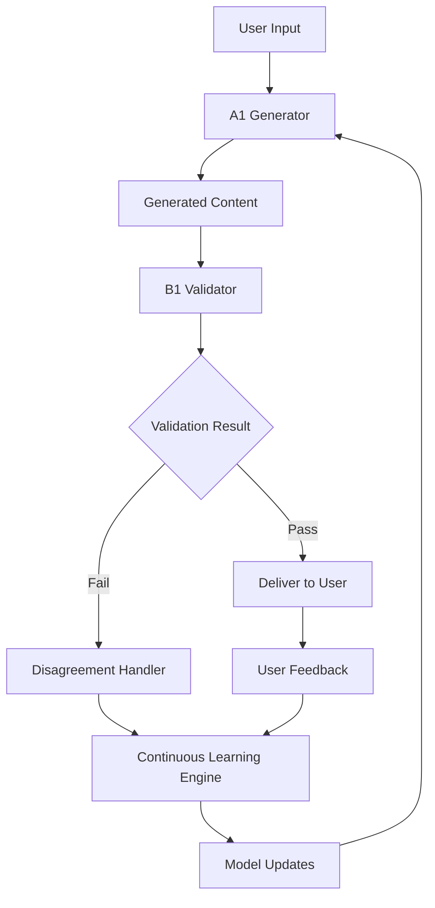

# IOC Dual-AI System Implementation Plan

## Executive Summary
This document outlines the comprehensive implementation plan for IOC's non-negotiable dual-AI system with continuous improvement capabilities. The system consists of two primary AI components:
- **A1 Generator**: Content generation and response creation
- **B1 Validator**: Ethical review, bias detection, and validation

## 1. System Architecture Design

### 1.1 A1 Generator Component

#### Capabilities
- **Content Generation**: Generate assessment questions, recommendations, and insights
- **Response Creation**: Create personalized coaching responses
- **Pattern Recognition**: Identify user patterns and trends
- **Adaptive Learning**: Improve responses based on user feedback

#### Technical Specifications
```typescript
interface A1Generator {
  model: {
    primary: 'gpt-4-turbo' | 'claude-3-opus';
    fallback: 'gpt-3.5-turbo' | 'claude-3-sonnet';
  };
  capabilities: {
    maxTokens: 8192;
    temperature: 0.7;
    topP: 0.9;
  };
  specializations: [
    'assessment_generation',
    'insight_creation',
    'recommendation_engine',
    'coaching_responses'
  ];
}
```

#### Integration Points
- Assessment Engine
- Report Generator
- Coaching System
- Real-time Dashboard

### 1.2 B1 Validator Component

#### Capabilities
- **Ethical Review**: Ensure content adheres to ethical guidelines
- **Bias Detection**: Identify and flag potential biases
- **Quality Validation**: Verify accuracy and appropriateness
- **Compliance Check**: Ensure regulatory compliance

#### Technical Specifications
```typescript
interface B1Validator {
  model: {
    primary: 'claude-3-opus';  // Known for ethical reasoning
    secondary: 'gpt-4-turbo';  // Cross-validation
  };
  validationCriteria: {
    ethicalGuidelines: string[];
    biasThresholds: BiasMetrics;
    qualityMetrics: QualityScore;
    complianceRules: ComplianceRule[];
  };
  reviewModes: [
    'real_time',      // Immediate validation
    'batch',          // Periodic review
    'deep_analysis'   // Comprehensive audit
  ];
}
```

### 1.3 Feedback Loop Architecture



### 1.4 Data Flow Design

```typescript
interface DualAIDataFlow {
  request: {
    id: string;
    userId: string;
    type: 'assessment' | 'report' | 'coaching' | 'insight';
    context: Record<string, any>;
    timestamp: Date;
  };
  
  generation: {
    requestId: string;
    generatorModel: string;
    content: any;
    metadata: {
      processingTime: number;
      confidence: number;
      reasoning: string[];
    };
  };
  
  validation: {
    requestId: string;
    validatorModel: string;
    status: 'approved' | 'rejected' | 'modified';
    issues: ValidationIssue[];
    suggestions: string[];
    ethicalScore: number;
    biasScore: number;
  };
  
  resolution: {
    finalContent: any;
    disagreements: Disagreement[];
    learningPoints: LearningPoint[];
  };
}
```

## 2. Technical Implementation

### 2.1 API Design

#### Core API Endpoints

```typescript
// Dual AI Service API
interface DualAIAPI {
  // Generate and validate content
  POST /api/ai/generate
    body: {
      type: ContentType;
      context: Record<string, any>;
      options?: GenerationOptions;
    }
    response: {
      content: any;
      validationResult: ValidationResult;
      metadata: ResponseMetadata;
    }

  // Submit disagreement for learning
  POST /api/ai/disagreement
    body: {
      requestId: string;
      userFeedback: string;
      correctContent?: any;
    }

  // Get AI system metrics
  GET /api/ai/metrics
    response: {
      concordanceRate: number;
      averageProcessingTime: number;
      disagreementCount: number;
      learningMetrics: LearningMetrics;
    }

  // Retrain models (admin only)
  POST /api/ai/retrain
    body: {
      targetModel: 'A1' | 'B1' | 'both';
      trainingData?: string;  // S3 bucket path
    }
}
```

#### Internal Service Communication

```typescript
// Message Queue for Async Processing
interface AIMessageQueue {
  queues: {
    generation: 'ai-generation-queue';
    validation: 'ai-validation-queue';
    learning: 'ai-learning-queue';
  };
  
  messages: {
    GenerationRequest: {
      id: string;
      priority: 'high' | 'normal' | 'low';
      payload: GenerationPayload;
    };
    
    ValidationRequest: {
      id: string;
      generationId: string;
      content: any;
      urgency: boolean;
    };
    
    LearningEvent: {
      type: 'disagreement' | 'feedback' | 'correction';
      data: LearningData;
    };
  };
}
```

### 2.2 Database Schema

```sql
-- AI Request tracking
CREATE TABLE ai_requests (
    id UUID PRIMARY KEY DEFAULT uuid_generate_v4(),
    user_id UUID REFERENCES profiles(id),
    organization_id UUID REFERENCES organizations(id),
    request_type VARCHAR(50) NOT NULL,
    context JSONB NOT NULL,
    status VARCHAR(20) DEFAULT 'pending',
    created_at TIMESTAMP WITH TIME ZONE DEFAULT NOW(),
    completed_at TIMESTAMP WITH TIME ZONE
);

-- AI Generations
CREATE TABLE ai_generations (
    id UUID PRIMARY KEY DEFAULT uuid_generate_v4(),
    request_id UUID REFERENCES ai_requests(id),
    model_name VARCHAR(100) NOT NULL,
    model_version VARCHAR(50) NOT NULL,
    content JSONB NOT NULL,
    processing_time_ms INTEGER,
    confidence_score DECIMAL(3,2),
    token_count INTEGER,
    reasoning JSONB,
    created_at TIMESTAMP WITH TIME ZONE DEFAULT NOW()
);

-- AI Validations
CREATE TABLE ai_validations (
    id UUID PRIMARY KEY DEFAULT uuid_generate_v4(),
    generation_id UUID REFERENCES ai_generations(id),
    validator_model VARCHAR(100) NOT NULL,
    validation_status VARCHAR(20) NOT NULL,
    ethical_score DECIMAL(3,2),
    bias_score DECIMAL(3,2),
    quality_score DECIMAL(3,2),
    issues JSONB DEFAULT '[]',
    suggestions JSONB DEFAULT '[]',
    processing_time_ms INTEGER,
    created_at TIMESTAMP WITH TIME ZONE DEFAULT NOW()
);

-- AI Disagreements
CREATE TABLE ai_disagreements (
    id UUID PRIMARY KEY DEFAULT uuid_generate_v4(),
    request_id UUID REFERENCES ai_requests(id),
    generation_id UUID REFERENCES ai_generations(id),
    validation_id UUID REFERENCES ai_validations(id),
    disagreement_type VARCHAR(50) NOT NULL,
    generator_position JSONB NOT NULL,
    validator_position JSONB NOT NULL,
    resolution_status VARCHAR(20) DEFAULT 'pending',
    resolution JSONB,
    created_at TIMESTAMP WITH TIME ZONE DEFAULT NOW(),
    resolved_at TIMESTAMP WITH TIME ZONE
);

-- Learning Events
CREATE TABLE ai_learning_events (
    id UUID PRIMARY KEY DEFAULT uuid_generate_v4(),
    event_type VARCHAR(50) NOT NULL,
    source_id UUID, -- Can reference various tables
    source_type VARCHAR(50),
    learning_data JSONB NOT NULL,
    impact_score DECIMAL(3,2),
    applied BOOLEAN DEFAULT FALSE,
    created_at TIMESTAMP WITH TIME ZONE DEFAULT NOW()
);

-- Model Performance Metrics
CREATE TABLE ai_model_metrics (
    id UUID PRIMARY KEY DEFAULT uuid_generate_v4(),
    model_name VARCHAR(100) NOT NULL,
    metric_type VARCHAR(50) NOT NULL,
    metric_value DECIMAL(10,4),
    period_start TIMESTAMP WITH TIME ZONE,
    period_end TIMESTAMP WITH TIME ZONE,
    metadata JSONB DEFAULT '{}',
    created_at TIMESTAMP WITH TIME ZONE DEFAULT NOW()
);

-- Create indexes for performance
CREATE INDEX idx_ai_requests_user ON ai_requests(user_id);
CREATE INDEX idx_ai_requests_status ON ai_requests(status);
CREATE INDEX idx_ai_generations_request ON ai_generations(request_id);
CREATE INDEX idx_ai_validations_generation ON ai_validations(generation_id);
CREATE INDEX idx_ai_disagreements_status ON ai_disagreements(resolution_status);
CREATE INDEX idx_ai_learning_events_type ON ai_learning_events(event_type);
CREATE INDEX idx_ai_model_metrics_model_type ON ai_model_metrics(model_name, metric_type);
```

### 2.3 Caching Strategy

```typescript
interface AICachingStrategy {
  layers: {
    // L1: In-memory cache for hot data
    memory: {
      provider: 'node-cache' | 'redis';
      ttl: 300; // 5 minutes
      maxSize: '100MB';
      data: ['frequent_prompts', 'validation_rules'];
    };
    
    // L2: Redis for distributed cache
    redis: {
      ttl: 3600; // 1 hour
      patterns: {
        generation: 'ai:gen:{requestType}:{contextHash}';
        validation: 'ai:val:{contentHash}';
        metrics: 'ai:metrics:{modelName}:{date}';
      };
    };
    
    // L3: CDN for static AI responses
    cdn: {
      provider: 'cloudflare';
      ttl: 86400; // 24 hours
      paths: ['/api/ai/common-responses/*'];
    };
  };
  
  invalidation: {
    triggers: ['model_update', 'rule_change', 'manual_refresh'];
    strategy: 'cascade'; // Invalidate all dependent caches
  };
}
```

### 2.4 Async Processing Architecture

```typescript
interface AsyncProcessingSystem {
  // Worker Configuration
  workers: {
    generation: {
      concurrency: 10;
      timeout: 30000; // 30 seconds
      retries: 3;
    };
    validation: {
      concurrency: 20;
      timeout: 15000; // 15 seconds
      retries: 2;
    };
    learning: {
      concurrency: 5;
      timeout: 60000; // 1 minute
      batch_size: 100;
    };
  };
  
  // Queue Management
  queues: {
    provider: 'bull' | 'aws-sqs';
    deadLetterQueue: true;
    monitoring: 'datadog' | 'cloudwatch';
  };
  
  // Priority Handling
  priorities: {
    realtime_coaching: 1;
    assessment_generation: 2;
    report_creation: 3;
    batch_analysis: 4;
  };
}
```

### 2.5 Fallback Mechanisms

```typescript
interface FallbackStrategy {
  scenarios: {
    // A1 Generator Failures
    generatorFailure: {
      primary: 'retry_with_backoff';
      secondary: 'use_fallback_model';
      tertiary: 'return_cached_similar';
      final: 'return_generic_response';
    };
    
    // B1 Validator Failures
    validatorFailure: {
      primary: 'retry_once';
      secondary: 'use_secondary_validator';
      tertiary: 'apply_rule_based_validation';
      final: 'flag_for_human_review';
    };
    
    // System Overload
    systemOverload: {
      strategy: 'circuit_breaker';
      threshold: 0.8; // 80% capacity
      cooldown: 300; // 5 minutes
      degraded_mode: 'essential_only';
    };
  };
  
  monitoring: {
    alerts: ['email', 'slack', 'pagerduty'];
    metrics: ['failure_rate', 'fallback_usage', 'response_time'];
  };
}
```

## 3. Continuous Improvement Engine

### 3.1 Disagreement Tracking System

```typescript
interface DisagreementTracker {
  // Disagreement Categories
  categories: {
    ethical_concern: {
      severity: 'high';
      examples: ['bias', 'discrimination', 'harmful_content'];
    };
    factual_error: {
      severity: 'medium';
      examples: ['incorrect_data', 'outdated_info'];
    };
    quality_issue: {
      severity: 'low';
      examples: ['grammar', 'clarity', 'relevance'];
    };
  };
  
  // Tracking Mechanism
  tracking: {
    capture: {
      automatic: boolean;
      threshold: number; // Confidence delta
      metadata: string[];
    };
    
    storage: {
      database: 'postgresql';
      retention: '90_days';
      encryption: 'aes-256';
    };
    
    analysis: {
      frequency: 'daily';
      algorithms: ['pattern_detection', 'trend_analysis'];
      reporting: 'weekly';
    };
  };
}
```

### 3.2 Retraining Pipeline

```typescript
interface RetrainingPipeline {
  // Data Collection
  dataCollection: {
    sources: [
      'disagreements',
      'user_feedback',
      'expert_annotations',
      'performance_metrics'
    ];
    
    preprocessing: {
      cleaning: ['deduplication', 'normalization'];
      augmentation: ['paraphrasing', 'context_expansion'];
      validation: ['schema_check', 'quality_filter'];
    };
  };
  
  // Training Process
  training: {
    schedule: {
      minor_updates: 'weekly';
      major_updates: 'monthly';
      full_retrain: 'quarterly';
    };
    
    infrastructure: {
      provider: 'aws_sagemaker' | 'gcp_vertex_ai';
      gpu_type: 'a100' | 'v100';
      distributed: true;
    };
    
    validation: {
      test_split: 0.2;
      metrics: ['accuracy', 'f1_score', 'concordance'];
      threshold: 0.95; // Minimum performance
    };
  };
  
  // Deployment
  deployment: {
    strategy: 'blue_green';
    canary_rollout: {
      initial: 0.05; // 5% traffic
      steps: [0.1, 0.25, 0.5, 1.0];
      duration: '24_hours';
    };
    rollback: {
      automatic: true;
      triggers: ['error_rate', 'latency', 'disagreement_spike'];
    };
  };
}
```

### 3.3 Performance Metrics

```typescript
interface PerformanceMetrics {
  // Concordance Metrics
  concordance: {
    overall_rate: number; // Percentage of agreement
    by_category: Record<string, number>;
    trend: 'improving' | 'stable' | 'declining';
  };
  
  // Accuracy Metrics
  accuracy: {
    generation_quality: number;
    validation_precision: number;
    user_satisfaction: number;
  };
  
  // Efficiency Metrics
  efficiency: {
    avg_processing_time: number;
    throughput: number; // requests/second
    resource_utilization: number;
  };
  
  // Learning Metrics
  learning: {
    improvement_rate: number;
    knowledge_retention: number;
    adaptation_speed: number;
  };
}
```

### 3.4 Automated Learning Cycles

```typescript
interface AutomatedLearningCycle {
  // Continuous Learning Loop
  phases: {
    // Phase 1: Data Collection (Daily)
    collection: {
      duration: '24_hours';
      sources: ['production_traffic', 'user_feedback'];
      volume: 'unlimited';
    };
    
    // Phase 2: Analysis (Daily)
    analysis: {
      algorithms: [
        'disagreement_clustering',
        'pattern_recognition',
        'anomaly_detection'
      ];
      outputs: ['insights', 'training_candidates'];
    };
    
    // Phase 3: Model Update (Weekly)
    update: {
      type: 'incremental';
      techniques: ['fine_tuning', 'few_shot_learning'];
      validation: 'automated_testing';
    };
    
    // Phase 4: Evaluation (Weekly)
    evaluation: {
      metrics: ['before_after_comparison', 'a_b_testing'];
      decision: 'automatic' | 'human_review';
    };
  };
  
  // Feedback Integration
  feedback: {
    implicit: {
      sources: ['user_behavior', 'acceptance_rate'];
      weight: 0.3;
    };
    explicit: {
      sources: ['ratings', 'corrections', 'reports'];
      weight: 0.7;
    };
  };
}
```

### 3.5 Human Curator Integration

```typescript
interface HumanCuratorSystem {
  // Curator Roles
  roles: {
    expert_reviewer: {
      responsibilities: ['complex_disagreements', 'ethical_decisions'];
      access_level: 'full';
      tools: ['annotation_ui', 'override_controls'];
    };
    
    quality_analyst: {
      responsibilities: ['pattern_review', 'metric_validation'];
      access_level: 'read_annotate';
      tools: ['analytics_dashboard', 'feedback_system'];
    };
  };
  
  // Integration Points
  integration: {
    // Escalation Triggers
    escalation: {
      automatic: {
        high_severity_disagreement: true;
        ethical_concern: true;
        repeated_pattern: true;
      };
      threshold: {
        disagreement_score: 0.8;
        frequency: 5; // Same issue 5 times
      };
    };
    
    // Curator Interface
    interface: {
      dashboard: '/admin/ai-curator';
      features: [
        'disagreement_queue',
        'annotation_tools',
        'bulk_actions',
        'training_data_export'
      ];
    };
    
    // Feedback Loop
    feedback: {
      capture: 'structured_forms';
      integration: 'immediate';
      impact: 'weighted_high';
    };
  };
}
```

## 4. Integration with IOC Platform

### 4.1 Assessment Generation Workflow

```typescript
interface AssessmentGenerationWorkflow {
  // Request Flow
  flow: {
    1: 'User requests assessment';
    2: 'Context gathering (user profile, history)';
    3: 'A1 generates questions';
    4: 'B1 validates for bias and appropriateness';
    5: 'Disagreement resolution if needed';
    6: 'Final assessment delivery';
  };
  
  // Integration Code
  implementation: {
    async generateAssessment(userId: string, type: AssessmentType) {
      // Gather context
      const context = await gatherUserContext(userId);
      
      // Generate with A1
      const generated = await a1Generator.generate({
        type: 'assessment',
        assessmentType: type,
        context
      });
      
      // Validate with B1
      const validation = await b1Validator.validate(generated);
      
      // Handle disagreements
      if (validation.status === 'rejected') {
        const resolved = await disagreementHandler.resolve(
          generated,
          validation
        );
        return resolved;
      }
      
      return generated;
    }
  };
}
```

### 4.2 Report Generation with Dual Validation

```typescript
interface ReportGenerationSystem {
  // Report Types
  types: {
    individual: {
      sections: ['summary', 'insights', 'recommendations'];
      validation_focus: ['personal_sensitivity', 'actionability'];
    };
    executive: {
      sections: ['overview', 'metrics', 'strategic_recommendations'];
      validation_focus: ['business_relevance', 'data_accuracy'];
    };
    organizational: {
      sections: ['culture_analysis', 'performance_metrics', 'roadmap'];
      validation_focus: ['organizational_fit', 'strategic_alignment'];
    };
  };
  
  // Dual Validation Process
  validation: {
    content_checks: [
      'factual_accuracy',
      'bias_detection',
      'tone_appropriateness',
      'actionability'
    ];
    
    quality_metrics: {
      readability: 'flesch_kincaid';
      coherence: 'embedding_similarity';
      completeness: 'section_coverage';
    };
  };
}
```

### 4.3 Prompt Library Enhancement

```typescript
interface PromptLibraryEnhancement {
  // Dynamic Prompt Generation
  dynamic: {
    base_prompts: Map<string, BasePrompt>;
    modifiers: {
      user_context: ContextModifier[];
      cultural_adaptation: CulturalModifier[];
      industry_specific: IndustryModifier[];
    };
    
    generation: {
      async createPrompt(type: string, context: Context) {
        const base = this.base_prompts.get(type);
        const modified = await this.applyModifiers(base, context);
        const validated = await b1Validator.validatePrompt(modified);
        return validated;
      }
    };
  };
  
  // Prompt Evolution
  evolution: {
    tracking: {
      usage_metrics: Map<string, UsageMetrics>;
      effectiveness: Map<string, EffectivenessScore>;
    };
    
    optimization: {
      a_b_testing: boolean;
      automatic_improvement: boolean;
      human_review_threshold: number;
    };
  };
}
```

### 4.4 Real-time Coaching Recommendations

```typescript
interface RealtimeCoachingSystem {
  // Real-time Processing
  realtime: {
    latency_target: 500; // milliseconds
    optimization: {
      pre_computed_responses: boolean;
      edge_deployment: boolean;
      streaming_responses: boolean;
    };
  };
  
  // Coaching Intelligence
  intelligence: {
    // Context Analysis
    context: {
      current_state: UserState;
      historical_patterns: Pattern[];
      immediate_needs: Need[];
    };
    
    // Response Generation
    generation: {
      async generateCoaching(context: CoachingContext) {
        // Parallel processing for speed
        const [insight, recommendation] = await Promise.all([
          a1Generator.generateInsight(context),
          a1Generator.generateRecommendation(context)
        ]);
        
        // Fast validation
        const validated = await b1Validator.quickValidate({
          insight,
          recommendation
        });
        
        return {
          insight: validated.insight,
          recommendation: validated.recommendation,
          confidence: validated.confidence
        };
      }
    };
  };
}
```

## 5. MVP Implementation Plan

### Phase 1: Basic Dual-AI with Manual Improvement (Weeks 1-4)

#### Week 1-2: Core Infrastructure
```typescript
const phase1Tasks = {
  infrastructure: [
    'Set up AI service architecture',
    'Implement basic A1 Generator',
    'Implement basic B1 Validator',
    'Create database schema',
    'Set up message queues'
  ],
  
  apis: [
    'Create generation endpoint',
    'Create validation endpoint',
    'Implement basic caching',
    'Add error handling'
  ],
  
  integration: [
    'Connect to assessment engine',
    'Basic report generation',
    'Simple coaching responses'
  ]
};
```

#### Week 3-4: Manual Review System
```typescript
const manualReviewTasks = {
  ui: [
    'Admin dashboard for disagreements',
    'Annotation interface',
    'Metrics visualization'
  ],
  
  workflow: [
    'Disagreement capture',
    'Human review queue',
    'Resolution tracking'
  ],
  
  testing: [
    'Unit tests for AI components',
    'Integration tests',
    'Performance benchmarks'
  ]
};
```

### Phase 2: Automated Disagreement Tracking (Weeks 5-8)

#### Week 5-6: Disagreement System
```typescript
const phase2Tasks = {
  tracking: [
    'Automatic disagreement detection',
    'Categorization system',
    'Pattern recognition',
    'Alerting mechanism'
  ],
  
  analytics: [
    'Disagreement analytics dashboard',
    'Trend visualization',
    'Performance metrics',
    'Export capabilities'
  ]
};
```

#### Week 7-8: Learning Preparation
```typescript
const learningPrepTasks = {
  data_pipeline: [
    'Data collection framework',
    'Preprocessing pipeline',
    'Training data storage',
    'Validation datasets'
  ],
  
  infrastructure: [
    'ML pipeline setup',
    'Training environment',
    'Model versioning',
    'A/B testing framework'
  ]
};
```

### Phase 3: Full Continuous Learning System (Weeks 9-12)

#### Week 9-10: Automated Learning
```typescript
const phase3Tasks = {
  learning_engine: [
    'Automatic retraining pipeline',
    'Incremental learning',
    'Model evaluation',
    'Deployment automation'
  ],
  
  optimization: [
    'Performance optimization',
    'Scaling improvements',
    'Cost optimization',
    'Monitoring enhancement'
  ]
};
```

#### Week 11-12: Production Readiness
```typescript
const productionTasks = {
  reliability: [
    'Fault tolerance testing',
    'Disaster recovery',
    'Load testing',
    'Security audit'
  ],
  
  documentation: [
    'API documentation',
    'Integration guides',
    'Best practices',
    'Troubleshooting guides'
  ],
  
  launch: [
    'Staged rollout plan',
    'Monitoring setup',
    'Support preparation',
    'Success metrics'
  ]
};
```

### Timeline Summary

| Phase | Duration | Key Deliverables | Success Metrics |
|-------|----------|------------------|-----------------|
| Phase 1 | 4 weeks | Basic dual-AI system | 95% uptime, <1s response |
| Phase 2 | 4 weeks | Automated tracking | 90% disagreement capture |
| Phase 3 | 4 weeks | Full learning system | 10% improvement in concordance |

### Resource Requirements

#### Team Composition
```typescript
const teamRequirements = {
  engineering: {
    ai_engineers: 2,
    backend_engineers: 2,
    frontend_engineers: 1,
    devops_engineers: 1
  },
  
  ai_specialists: {
    ml_engineers: 2,
    data_scientists: 1,
    prompt_engineers: 1
  },
  
  support: {
    product_manager: 1,
    qa_engineers: 2,
    technical_writer: 1
  }
};
```

#### Infrastructure Costs (Monthly)
```typescript
const infrastructureCosts = {
  compute: {
    api_servers: '$500',  // 4x t3.large
    worker_nodes: '$800', // 4x c5.2xlarge
    gpu_training: '$2000' // Periodic p3.2xlarge
  },
  
  ai_services: {
    openai_api: '$3000',  // ~10M tokens/month
    anthropic_api: '$2000', // ~5M tokens/month
  },
  
  storage_and_data: {
    database: '$200',     // RDS PostgreSQL
    redis: '$150',        // ElastiCache
    s3_storage: '$100',   // Training data
    monitoring: '$200'    // DataDog/CloudWatch
  },
  
  total_monthly: '$9,000' // With 20% buffer
};
```

## 6. Success Metrics and KPIs

### Technical Metrics
```typescript
const technicalKPIs = {
  performance: {
    response_time_p99: '<1000ms',
    throughput: '>100 req/sec',
    availability: '>99.9%'
  },
  
  ai_quality: {
    concordance_rate: '>85%',
    user_acceptance: '>90%',
    bias_incidents: '<0.1%'
  },
  
  learning_effectiveness: {
    monthly_improvement: '>2%',
    disagreement_reduction: '>5%',
    accuracy_increase: '>3%'
  }
};
```

### Business Metrics
```typescript
const businessKPIs = {
  user_satisfaction: {
    nps_score: '>70',
    support_tickets: '<5%',
    feature_adoption: '>80%'
  },
  
  operational_efficiency: {
    cost_per_request: '<$0.10',
    human_intervention: '<2%',
    processing_time: '<30sec'
  },
  
  competitive_advantage: {
    unique_insights: '>60%',
    accuracy_vs_competition: '+15%',
    time_to_insight: '-50%'
  }
};
```

## Conclusion

This comprehensive implementation plan provides a clear roadmap for building IOC's dual-AI system with continuous improvement capabilities. The phased approach ensures steady progress while maintaining system stability and allowing for learning and adjustment along the way.

The system's design prioritizes:
1. **Ethical AI**: Through the B1 Validator component
2. **Continuous Improvement**: Through automated learning cycles
3. **Scalability**: Through distributed architecture
4. **Reliability**: Through fallback mechanisms
5. **User Value**: Through improved accuracy and insights

With proper execution, this system will provide IOC with a significant competitive advantage in the intelligence operations space.