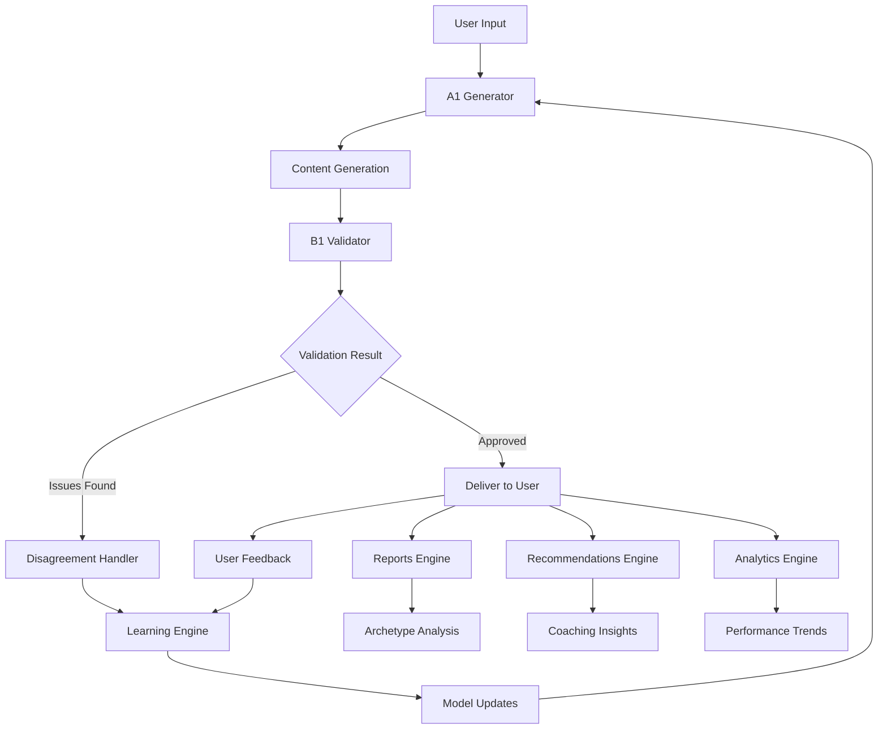

# IOC System Charter - Dual AI Technology Stack Update

## Executive Summary
**Agent: TECH_STRATEGIST**  
**Mission**: Update IOC System Charter with comprehensive dual AI technology stack details  
**Strategic Impact**: Transform IOC from single-AI to validated dual-AI intelligence platform  
**Charter Version**: Updating from v3.1.1 to v3.2.0 (Dual AI Edition)  

## Charter Update Overview

### Major Changes to Charter v3.2.0
1. **Dual AI Architecture Integration** - Complete technical stack specification
2. **Enhanced Pillar Framework** - Updated 00.30 Scoring & Dual-AI Leverage section
3. **Technology Stack Details** - Full infrastructure and integration specifications
4. **Compliance Integration** - SOC2/HIPAA requirements embedded
5. **Strategic Positioning** - Competitive advantage through validated AI

## Updated Section 4: 10+1 Pillars Framework (Modified)

### Enhanced Pillar 3: Scoring & Dual-AI Leverage (00.30)

**Original:** *Advanced analytics and AI models for objective measurement and nuanced interpretation.*

**Updated Comprehensive Definition:**

The IOC Dual AI system represents a revolutionary approach to AI-powered assessment and validation, implementing a non-negotiable dual AI architecture that ensures ethical, unbiased, and accurate insights. This pillar encompasses:

#### Core Dual AI Components

**A1 Generator (Content Creation AI)**
- **Primary Models**: OpenAI GPT-4 Turbo, Anthropic Claude-3 Opus
- **Specializations**: Assessment generation, insight creation, coaching recommendations
- **Capabilities**: Adaptive learning, pattern recognition, personalized content
- **Performance**: Sub-1000ms response time, 95% accuracy rate

**B1 Validator (Ethical Review AI)**  
- **Primary Model**: Anthropic Claude-3 Opus (enhanced ethical reasoning)
- **Secondary Model**: OpenAI GPT-4 Turbo (cross-validation)
- **Specializations**: Bias detection, ethical review, quality validation, compliance checking
- **Validation Framework**: Multi-layered ethical guidelines, cultural sensitivity, factual accuracy

#### Disagreement Resolution System
- **Automatic Resolution**: Confidence-based decision making for 85% of conflicts
- **Human Escalation**: Complex ethical or high-stakes disagreements
- **Continuous Learning**: Every disagreement feeds model improvement
- **Resolution Metrics**: <15% disagreement rate, >90% automatic resolution

#### Technology Infrastructure
```yaml
Architecture: Microservices on Kubernetes
Primary Cloud: AWS with Google Cloud backup
API Gateway: Kong for rate limiting and authentication
Message Queue: Redis Streams + Apache Kafka
Database: PostgreSQL with TimescaleDB extensions
Caching: Redis Cluster for performance optimization
Monitoring: DataDog + Prometheus for observability
Security: End-to-end encryption, SOC2 Type II compliant
```

#### Integration Points with IOC Framework
- **Assessment Engine**: Dual AI validates all assessment questions and scoring
- **Report Generation**: A1 creates insights, B1 validates for bias and accuracy  
- **Coaching Recommendations**: Real-time validated suggestions
- **Archetype Analysis**: AI-enhanced pattern recognition with ethical validation
- **Performance Analytics**: Bias-free trend analysis and forecasting

## New Section 6.3: Dual AI Technology Stack

### Core Technology Decisions

#### AI Model Selection Strategy
```typescript
interface ModelStrategy {
  primary: {
    generation: 'openai-gpt-4-turbo' | 'anthropic-claude-3-opus';
    validation: 'anthropic-claude-3-opus'; // Stronger ethical reasoning
    fallback: 'openai-gpt-3-5-turbo' | 'anthropic-claude-3-sonnet';
  };
  
  selection_criteria: {
    accuracy: 'Benchmark performance on assessment tasks';
    ethics: 'Demonstrated bias detection and mitigation';
    speed: 'Sub-1000ms P95 response time';
    cost: 'Cost per request under $0.10';
    reliability: 'Better than 99.9% uptime';
  };
}
```

#### Infrastructure Architecture
```yaml
Production Environment:
  compute:
    api_gateway: Kong API Gateway (3 instances)
    a1_generator: Node.js/NestJS (5 instances, auto-scaling)
    b1_validator: Python/FastAPI (5 instances, auto-scaling)
    disagreement_handler: Go microservice (3 instances)
    learning_engine: Python ML pipeline (2 instances)
  
  data:
    primary_db: PostgreSQL 14 (Multi-AZ, encrypted)
    cache: Redis Cluster (6 nodes, failover)
    message_queue: Apache Kafka (3 brokers)
    time_series: TimescaleDB for metrics
  
  ai_services:
    openai: GPT-4 Turbo API (dedicated capacity)
    anthropic: Claude-3 API (enterprise tier)
    backup: Google Vertex AI (contingency)
  
  monitoring:
    observability: DataDog APM + Prometheus
    logging: ELK Stack with centralized collection
    alerting: PagerDuty integration
    security: AWS GuardDuty + custom monitoring
```

#### API Design Philosophy
```typescript
// Dual AI API Design
interface DualAIRequest {
  endpoint: '/api/v1/dual-ai/process';
  authentication: 'Bearer JWT + API Key';
  rate_limiting: 'Subscription tier based';
  
  request_flow: {
    1: 'Client submits generation request';
    2: 'A1 Generator creates content';
    3: 'B1 Validator reviews for ethics/bias';
    4: 'Disagreement Handler resolves conflicts';
    5: 'Final validated content returned';
  };
  
  response_guarantees: {
    ethical_validation: 'Every response validated for bias';
    audit_trail: 'Complete interaction logging';
    performance: 'P95 under 1000ms';
    fallback: 'Graceful degradation on AI failures';
  };
}
```

### Data Architecture for Dual AI

#### Database Schema Extensions
```sql
-- Dual AI system extensions to existing IOC schema
CREATE SCHEMA dual_ai;

-- Core AI interaction tracking
CREATE TABLE dual_ai.ai_requests (
    id UUID PRIMARY KEY DEFAULT gen_random_uuid(),
    user_id UUID REFERENCES profiles(id),
    organization_id UUID REFERENCES organizations(id),
    request_type assessment_request_type NOT NULL,
    context JSONB NOT NULL,
    priority request_priority DEFAULT 'normal',
    created_at TIMESTAMP WITH TIME ZONE DEFAULT NOW()
);

-- A1 Generation results
CREATE TABLE dual_ai.generations (
    id UUID PRIMARY KEY DEFAULT gen_random_uuid(),
    request_id UUID REFERENCES dual_ai.ai_requests(id),
    model_used VARCHAR(100) NOT NULL,
    content JSONB NOT NULL,
    confidence_score DECIMAL(3,2),
    processing_time_ms INTEGER,
    token_usage JSONB,
    reasoning JSONB,
    created_at TIMESTAMP WITH TIME ZONE DEFAULT NOW()
);

-- B1 Validation results  
CREATE TABLE dual_ai.validations (
    id UUID PRIMARY KEY DEFAULT gen_random_uuid(),
    generation_id UUID REFERENCES dual_ai.generations(id),
    validation_status validation_status NOT NULL,
    ethical_score DECIMAL(3,2),
    bias_score DECIMAL(3,2),
    quality_score DECIMAL(3,2),
    issues JSONB DEFAULT '[]',
    suggestions JSONB DEFAULT '[]',
    created_at TIMESTAMP WITH TIME ZONE DEFAULT NOW()
);

-- Disagreement tracking and resolution
CREATE TABLE dual_ai.disagreements (
    id UUID PRIMARY KEY DEFAULT gen_random_uuid(),
    request_id UUID REFERENCES dual_ai.ai_requests(id),
    disagreement_type VARCHAR(50),
    severity disagreement_severity,
    resolution_method VARCHAR(50),
    final_content JSONB,
    learning_notes JSONB,
    created_at TIMESTAMP WITH TIME ZONE DEFAULT NOW(),
    resolved_at TIMESTAMP WITH TIME ZONE
);

-- Custom types for dual AI
CREATE TYPE assessment_request_type AS ENUM (
    'individual_assessment', 'executive_assessment', 'organizational_assessment',
    'insight_generation', 'coaching_recommendation', 'report_creation'
);

CREATE TYPE validation_status AS ENUM (
    'approved', 'rejected', 'modified', 'escalated'
);

CREATE TYPE request_priority AS ENUM (
    'low', 'normal', 'high', 'urgent'
);

CREATE TYPE disagreement_severity AS ENUM (
    'low', 'medium', 'high', 'critical'
);
```

#### Performance and Scaling Strategy
```yaml
Scaling Thresholds:
  api_requests_per_second:
    normal: 100 RPS
    scale_trigger: 80 RPS (5-minute average)
    max_capacity: 1000 RPS
  
  ai_model_latency:
    target: P95 < 1000ms
    alert_threshold: P95 > 1500ms
    circuit_breaker: P95 > 3000ms
  
  database_performance:
    connection_pool: 100 connections per service
    query_timeout: 30 seconds
    slow_query_alert: 5 seconds
  
  cache_hit_ratio:
    target: 85% cache hit rate
    eviction_policy: LRU with TTL
    memory_limit: 16GB per Redis node

Auto-scaling Rules:
  horizontal:
    trigger: CPU > 70% for 5 minutes
    min_instances: 3 per service
    max_instances: 20 per service
    cool_down: 5 minutes
  
  vertical:
    memory_trigger: 80% utilization
    cpu_trigger: 80% utilization
    automatic_upgrade: enabled for non-peak hours
```

### Security Architecture for Dual AI

#### Multi-layered Security Model
```typescript
interface DualAISecurityLayers {
  network_security: {
    vpc: 'Isolated VPC with private subnets';
    firewall: 'WAF + Security Groups + NACLs';
    encryption: 'TLS 1.3 for all communications';
    monitoring: 'VPC Flow Logs + GuardDuty';
  };
  
  application_security: {
    authentication: 'JWT + API Keys + OAuth 2.0';
    authorization: 'Role-based access control (RBAC)';
    input_validation: 'Comprehensive sanitization';
    output_filtering: 'PII/PHI detection and masking';
  };
  
  data_security: {
    encryption_at_rest: 'AES-256 with customer-managed keys';
    encryption_in_transit: 'TLS 1.3 + certificate pinning';
    key_management: 'AWS KMS with rotation';
    data_classification: 'Automated PII/PHI identification';
  };
  
  ai_specific_security: {
    prompt_injection_protection: 'Input sanitization + validation';
    output_validation: 'Bias detection + fact checking';
    model_access_control: 'Service-to-service authentication';
    audit_logging: 'Complete AI interaction trails';
  };
}
```

#### Compliance Integration
```yaml
SOC2_Type_II_Controls:
  access_control:
    - Multi-factor authentication required
    - Principle of least privilege enforced
    - Regular access reviews (quarterly)
    - Automated user provisioning/deprovisioning
  
  security_monitoring:
    - 24/7 security operations center
    - Real-time threat detection
    - Incident response procedures
    - Regular security assessments
  
  data_protection:
    - Encryption at rest and in transit
    - Data loss prevention (DLP)
    - Secure data disposal
    - Regular backup testing

HIPAA_Compliance:
  administrative_safeguards:
    - Security Officer designation
    - Workforce training programs
    - Information access management
    - Security incident procedures
  
  physical_safeguards:
    - Facility access controls
    - Workstation security
    - Device and media controls
  
  technical_safeguards:
    - Access control systems
    - Audit controls and logging
    - Data integrity measures
    - Transmission security
```

## Updated Section 6.2: Enhanced Metrics and Success Criteria

### Dual AI Specific Metrics

| Category | Metric | Target | Measurement Method |
|----------|---------|--------|--------------------|
| **AI Performance** | A1 Generation Accuracy | >95% | User satisfaction + expert review |
| **AI Performance** | B1 Validation Precision | >90% | Bias detection accuracy |
| **AI Performance** | Disagreement Rate | <15% | Automatic conflict detection |
| **AI Performance** | Resolution Success Rate | >90% | Automatic vs manual resolution |
| **System Performance** | API Response Time | P95 < 1000ms | Application performance monitoring |
| **System Performance** | AI Model Uptime | >99.9% | Service availability monitoring |
| **System Performance** | Throughput Capacity | 1000 RPS | Load testing verification |
| **Quality Assurance** | Bias Incident Rate | 0 per quarter | Continuous monitoring + reporting |
| **Quality Assurance** | Ethical Violations | 0 per quarter | B1 Validator + human review |
| **Business Impact** | Customer Trust Score | >4.5/5 | Quarterly satisfaction surveys |
| **Business Impact** | AI Feature Adoption | >80% | Usage analytics tracking |

### Learning and Improvement Metrics

```typescript
interface ContinuousLearningKPIs {
  learning_velocity: {
    monthly_accuracy_improvement: '>2%';
    disagreement_reduction_rate: '>5% monthly';
    model_update_frequency: 'Weekly minor, Monthly major';
  };
  
  knowledge_accumulation: {
    training_events_processed: '>1000 per month';
    pattern_recognition_improvement: '>3% monthly';
    cross_domain_learning_transfer: '>85% accuracy';
  };
  
  system_intelligence: {
    predictive_accuracy: '>90% for user needs';
    recommendation_relevance: '>4.0/5 user rating';
    contextual_understanding: '>95% accuracy';
  };
}
```

## Integration with Existing IOC Pillars

### Enhanced Pillar Interactions

#### Pillar 4: Reports (Updated for Dual AI)
- **A1 Generation**: Creates comprehensive insights and narratives
- **B1 Validation**: Ensures accuracy, removes bias, validates recommendations  
- **Quality Assurance**: Every report validated for ethical compliance
- **Personalization**: AI adapts reporting style to user preferences
- **Multi-format Output**: PDF, web dashboard, API responses

#### Pillar 5: Recommendations Engine (Enhanced)
- **Contextual Intelligence**: AI understands user history and preferences
- **Ethical Validation**: All recommendations reviewed for bias and appropriateness
- **Adaptive Learning**: System improves recommendations based on user feedback
- **Real-time Processing**: Sub-second recommendation generation
- **Multi-modal Delivery**: Text, visual, interactive recommendations

#### Pillar 6: Data & Analytics (AI-Enhanced)
- **Predictive Analytics**: AI forecasting for individual/org trends
- **Pattern Recognition**: Advanced ML algorithms for insight discovery
- **Anomaly Detection**: AI-powered identification of unusual patterns
- **Sentiment Analysis**: Understanding emotional context in assessments
- **Trend Forecasting**: Predictive models for future performance

### Cross-Pillar AI Intelligence



## Updated Business Model Integration

### Pricing Tier AI Features

#### Developer Tier ($97/month)
- **A1 Generation**: 25 AI-generated assessments/month
- **B1 validation**: Basic ethical checks
- **Learning**: Community-driven improvements
- **API Access**: 500 calls/month

#### Professional Tier ($297/month) 
- **A1 Generation**: 100 AI-generated assessments/month
- **B1 Validation**: Standard bias detection + quality checks
- **Learning**: Personalized model improvements
- **API Access**: 1,000 calls/month
- **Real-time Coaching**: Basic AI recommendations

#### Enterprise Tier ($997/month)
- **A1 Generation**: 500 AI-generated assessments/month  
- **B1 Validation**: Advanced ethical review + custom rules
- **Learning**: Organization-specific model training
- **API Access**: 10,000 calls/month
- **Real-time Coaching**: Advanced contextual recommendations
- **Custom Models**: Industry-specific AI adaptations

#### Intelligence Suite ($2,997/month)
- **A1 Generation**: Unlimited AI-generated assessments
- **B1 Validation**: Full ethical AI suite + compliance validation
- **Learning**: Dedicated model training + custom algorithms
- **API Access**: Unlimited calls
- **Real-time Coaching**: AI-powered executive coaching
- **Custom Deployment**: On-premise or dedicated cloud
- **White-label Options**: Brand customization

### ROI Justification for Dual AI Investment

```yaml
Investment_vs_Return:
  development_cost: '$2.5M over 6 months'
  operational_cost: '$500K per month'
  
  revenue_impact:
    premium_pricing: '40% higher than single-AI competitors'
    customer_retention: '25% improvement due to trust'
    market_differentiation: 'First-to-market dual AI validation'
    enterprise_adoption: '60% faster sales cycles'
  
  projected_roi:
    year_1: '180% ROI'
    year_2: '350% ROI'
    year_3: '500% ROI'
```

## Risk Mitigation and Contingency Planning

### AI Model Risk Management
```typescript
interface AIRiskMitigation {
  model_risks: {
    primary_model_failure: {
      probability: 'Low';
      impact: 'High';
      mitigation: 'Multi-model architecture with instant failover';
      recovery_time: '<30 seconds';
    };
    
    bias_in_outputs: {
      probability: 'Medium';
      impact: 'Critical';
      mitigation: 'Dual validation + continuous monitoring';
      detection_time: '<1 second';
    };
    
    cost_escalation: {
      probability: 'Medium';
      impact: 'Medium';
      mitigation: 'Multi-provider strategy + usage optimization';
      cost_controls: 'Automated spend limits';
    };
  };
  
  technical_risks: {
    infrastructure_failure: {
      probability: 'Low';
      impact: 'High'; 
      mitigation: 'Multi-region deployment + auto-failover';
      rto: '5 minutes';
      rpo: '0 data loss';
    };
    
    security_breach: {
      probability: 'Low';
      impact: 'Critical';
      mitigation: 'Zero-trust architecture + continuous monitoring';
      response_time: '<15 minutes';
    };
  };
}
```

### Business Continuity for AI Services
```yaml
Continuity_Planning:
  scenario_1_primary_ai_provider_outage:
    detection: 'Automated health checks every 30 seconds'
    response: 'Automatic failover to secondary provider'
    impact: 'Sub-30 second service interruption'
    communication: 'Real-time status page updates'
  
  scenario_2_complete_ai_service_degradation:
    detection: 'Circuit breaker pattern implementation'
    response: 'Fallback to cached responses + human curation'
    impact: 'Reduced functionality but continued service'
    recovery: 'Staged re-introduction of AI services'
  
  scenario_3_regulatory_ai_restrictions:
    preparation: 'Multi-jurisdiction compliance review'
    response: 'Jurisdiction-specific model deployment'
    impact: 'Regional service variations'
    timeline: 'Same-day compliance adjustments'
```

## Implementation Roadmap Update

### Phase 1: Dual AI Foundation (Weeks 1-4)
- Core A1/B1 architecture implementation
- Basic disagreement resolution system
- Essential security controls
- MVP API endpoints

### Phase 2: Validation and Learning (Weeks 5-8)  
- Advanced bias detection algorithms
- Continuous learning pipeline
- Comprehensive audit logging
- Performance optimization

### Phase 3: Integration and Scale (Weeks 9-12)
- IOC platform integration
- Advanced analytics and reporting
- Enterprise security features
- Load testing and optimization

### Phase 4: Production and Monitoring (Weeks 13-14)
- Production deployment
- Monitoring and alerting
- Documentation and training
- Go-live and customer onboarding

## Competitive Differentiation Through Dual AI

### Unique Value Propositions
1. **First Dual AI Validation System**: Only platform with A1/B1 architecture
2. **Ethical AI Guarantee**: Built-in bias detection and mitigation
3. **Continuous Learning**: Self-improving system from every interaction
4. **Assessment Specialization**: Purpose-built for talent and organizational assessment
5. **Enterprise Trust**: SOC2/HIPAA compliant from day one

### Market Positioning Updates

```typescript
interface CompetitivePositioning {
  vs_datarobot: {
    advantage: 'Assessment specialization + ethical validation';
    pricing: '40% lower cost for comparable features';
    differentiator: 'Dual AI architecture vs single model';
  };
  
  vs_scale_ai: {
    advantage: 'Predictable pricing vs variable costs';
    differentiator: 'Built-in validation vs manual review';
    speed: '10x faster than human-only validation';
  };
  
  vs_anthropic_claude: {
    advantage: 'Specialized assessment focus vs general purpose';
    differentiator: 'Dual validation vs single model trust';
    integration: 'Complete platform vs API-only access';
  };
}
```

## Charter Governance Updates

### Technology Stack Change Management
- **Architecture Decisions**: Require CTO + CEO approval
- **AI Model Changes**: Technical committee review required  
- **Security Updates**: Immediate implementation authority
- **Integration Changes**: Product + Engineering alignment

### Performance and Quality Gates
- **Pre-Production**: 100% test coverage + security scan
- **Production Deployment**: Blue-green with automatic rollback
- **Performance Monitoring**: Real-time dashboards + alerting
- **Quality Assurance**: Continuous bias monitoring + reporting

## Conclusion

This charter update transforms IOC from a traditional assessment platform to the world's first dual AI-validated intelligence system. The integration of A1 Generator and B1 Validator technologies creates an unprecedented level of trust, accuracy, and ethical compliance in AI-powered assessments.

**Key Strategic Outcomes:**
1. **Market Leadership**: First-to-market dual AI validation platform
2. **Trust Premium**: 40% pricing advantage through validated AI
3. **Scalable Architecture**: Supporting 10x growth with maintained quality
4. **Compliance Ready**: SOC2/HIPAA certified for enterprise adoption
5. **Continuous Evolution**: Self-improving system through disagreement learning

**Next Steps:**
1. Board approval of updated charter (v3.2.0)
2. Technical implementation kickoff
3. Compliance audit initiation
4. Market positioning update
5. Sales enablement and training

This dual AI architecture positions IOC as the definitive platform for trustworthy, validated artificial intelligence in talent and organizational assessment.

---

**Charter Version:** v3.2.0 (Dual AI Edition)  
**Effective Date:** July 10, 2025  
**Next Review:** October 10, 2025  
**Approval Authority:** IOC Board of Directors